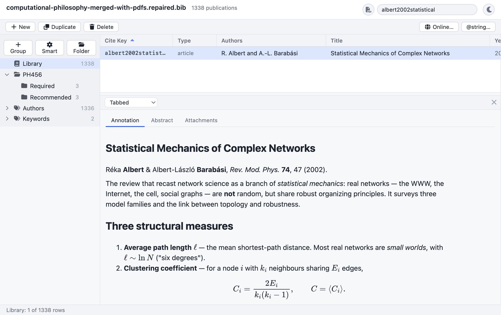
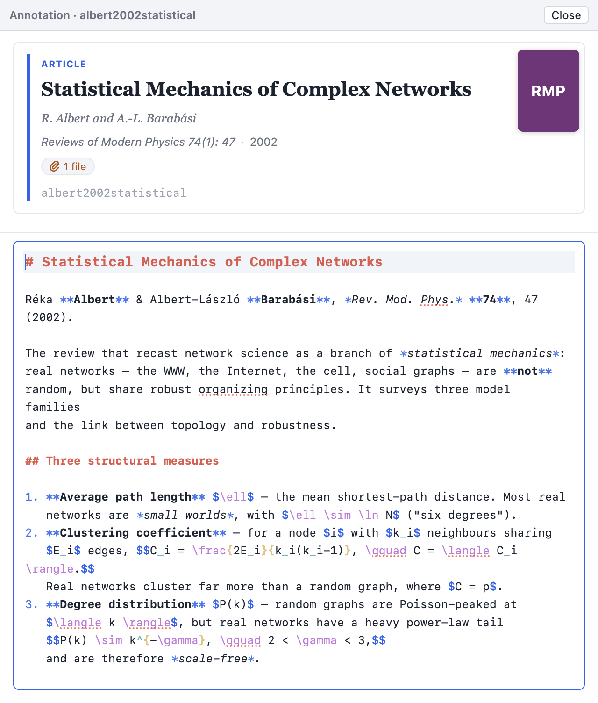
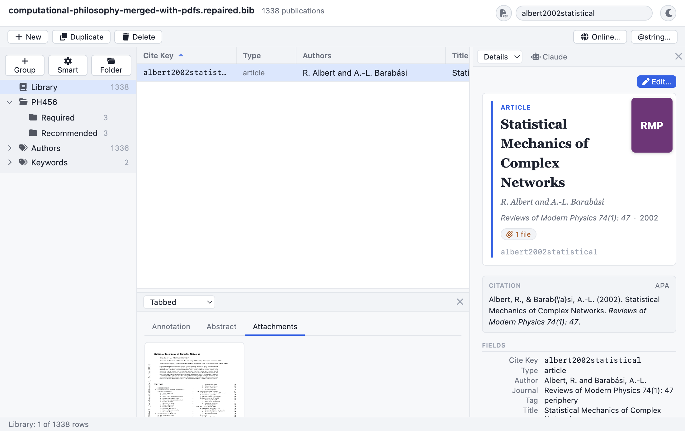
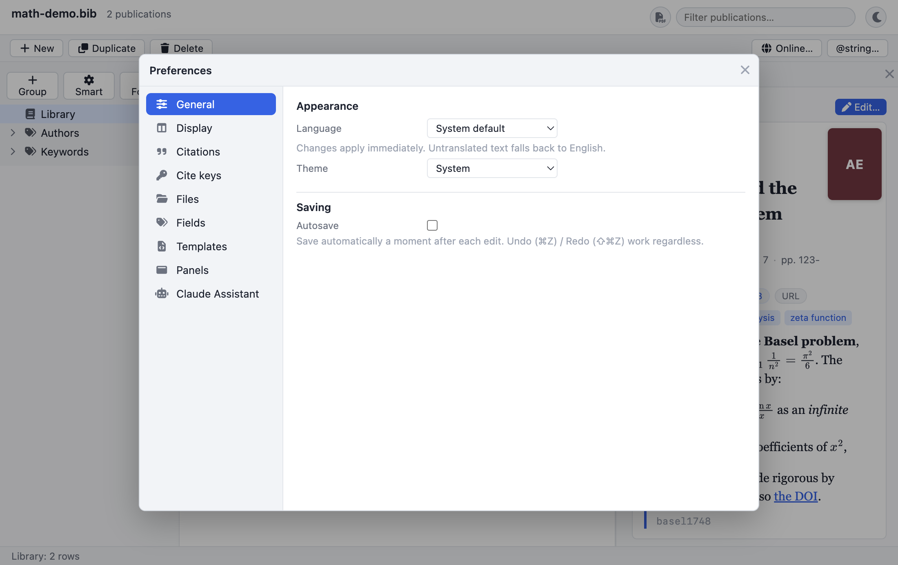
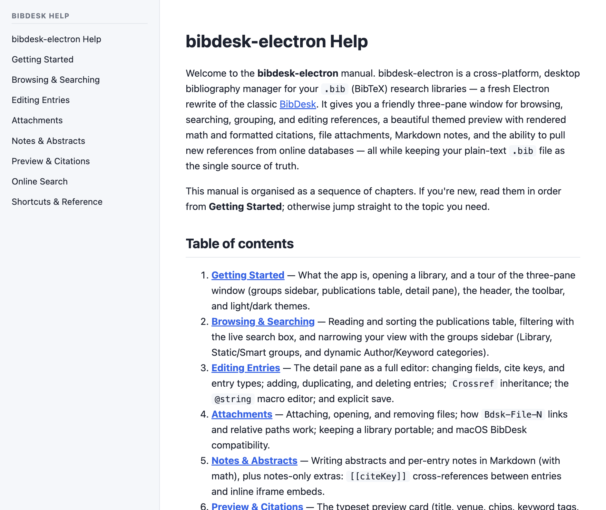

# Bibliofile

> A cross-platform desktop **bibliography manager** for your BibTeX (`.bib`)
> research libraries — a modern, themeable [Electron](https://www.electronjs.org/)
> rewrite of the classic macOS [BibDesk](https://bibdesk.sourceforge.io/).
> Your plain-text `.bib` file stays the **single source of truth**.


Bibliofile gives you a friendly three-pane window — a groups sidebar, a fast
virtualized publications table, and a configurable detail pane — for browsing,
searching, grouping, editing, and citing references. It renders a beautiful typeset
preview with **real math** and **formatted citations**, manages file attachments and
Markdown notes, pulls new references from online databases, and round-trips your file
**byte-for-byte** through a custom BibTeX parser, so it stays compatible with macOS
BibDesk and your TeX workflow.

> **Status.** Actively developed; in **beta**. Runs on macOS, Windows, and Linux.
> macOS builds are **code-signed + notarized** (Apple Developer ID); Windows and
> Linux build from source for now. ~1,600 passing unit/integration tests; all
> packages typecheck clean. Building from source needs Node.js 20+ and pnpm
> (see [Getting started](#getting-started)).

---

## Highlights

- 📚 **Byte-faithful BibTeX** round-trip — your file, your format, preserved exactly (verified byte-for-byte on a 1,300+ entry library).
- 🔎 Fast **virtualized table** with configurable columns, live filter, and SQLite **full-text search** — **quoted phrases** and PDF text, with a configurable page limit.
- 🗂️ **Groups**: Library, Static, Smart (condition builder), nestable **Folders**, and dynamic **Author / Keyword** categories.
- ✍️ Inline **editing** with field autocomplete, cite-key generation (single entry or a whole selection), `@string` macros, **Find & Replace**, and full **undo/redo**.
- 📝 **Markdown notes & abstracts** with math, **brace-safe storage**, and a standalone **annotation-editor window** that auto-saves.
- 🎨 Themed **preview** with MathJax math, chips, keyword tags, journal covers, and **light / dark** modes.
- 📑 Formatted **CSL citations** (APA / Vancouver / Harvard, offline) — install & manage your own `.csl` styles, cite in notes with `\cite{…}` / `@references`, and optionally make URLs/DOIs clickable.
- 🧮 **LaTeX preview** — typeset the selection's bibliography with your own TeX + `.bst` style (crisp SVG or PDF).
- 🪟 **Configurable panels** you can resize, hide, swap, and redesign with **Handlebars templates** — including a **tabbed** bottom panel (Annotation · Abstract · Attachments, with PDF/image thumbnails).
- 📥 **Import / export** — paste BibTeX, drag-and-drop `.bib`, **drop a PDF to auto-create an entry** (DOI/arXiv lookup + attach), RIS import; export BibTeX / RIS / CSV / styled HTML.
- 🌐 **Online search** of CrossRef and arXiv, importing results as new entries.
- 🤖 An optional **Claude assistant** in the side pane (bring your own API key).
- 🧩 **JavaScript scripting** — a Script Console + saved Scripts menu with a synchronous `bibliofile` API (read/edit entries, import/export, files, network, change hooks); one run is a single Undo. The cross-platform successor to AppleScript.
- 🌓 Native menus, keyboard shortcuts, a full in-app **manual**, and UI scaffolding for **30 languages**.

---

## Features in depth

### 📚 Library, browsing & search

- A **virtualized publications table** that stays smooth on large libraries, with
  sortable, **configurable columns** (any field, plus the keyword / attachment /
  Read / rating icon columns).
- **Live search** as you type, backed by an optional **SQLite FTS5 full-text index**
  that also searches extracted **PDF text**. Bare words match by prefix (AND);
  wrap a **"quoted phrase"** to require those words adjacent and in order. How many
  PDF pages are indexed is configurable (a page cap, or *all* pages for scanned books).
- A **groups sidebar**: the whole **Library**, **Static** groups, **Smart** groups
  (a condition builder over the entry fields), nestable **Folders**, and dynamic
  **Author** and **Keyword** category groups that build themselves from your data.
- **Find Duplicates** (by cite key and fuzzy title/author) and **Find Broken Links**
  for attachments that have moved.
- **Keyboard-first** navigation: arrow keys, type-ahead select, range/multi-select,
  and `Delete` to remove the selection.


### ✍️ Editing entries

- Edit fields **inline** in the detail pane, with **autocomplete** from existing
  values (keywords, journals, crossref keys).
- Change **cite keys** (with one-click **Generate** from a configurable format
  language — for a single entry or a **whole selection** in one undo step, kept
  unique across the batch) and **entry types**; add, duplicate, and delete entries.
- `Crossref` **inheritance**, the `@string` **macro editor**, and **Find & Replace**
  across fields.
- A real **undo / redo** stack (per document) and an optional **autosave**; otherwise
  edits are written only on explicit **Save** (atomic write + `.bak` backup) through
  the byte-faithful serializer.
- Select **multiple entries** to edit them together: a floating batch bar sets a
  field or adds/removes a keyword across the whole selection in **one undo step**.

### 📎 Attachments & files

- Attach, open (in your OS default app), and remove files; macOS BibDesk's
  `Bdsk-File-N` blobs and relative paths are fully supported, so libraries stay
  portable and round-trip cleanly.
- A **Links** section for `Url` / `Doi` (with bare-DOI → doi.org rewriting).
- **AutoFile** moves attachments into a Papers folder named by a format language,
  and **Folders** can export a mirrored directory tree of the attached PDFs.
- **Drop a PDF → a fully-populated entry.** Dropped PDFs are sniffed for a **DOI**
  (then an **arXiv** id) and looked up online (CrossRef / arXiv) to create a complete
  entry with the file attached — instantly. If you already have that paper, the PDF is
  **attached to the existing entry** instead of duplicating it. PDFs with no identifier
  open a **review dialog** — fill each one in with the normal entry editor and **Accept**
  (creates it + attaches the PDF) or **Discard**; nothing is added to your library until
  you Accept, so a big library never fills up with empty placeholders.

### 📝 Notes & abstracts

- Write abstracts and per-entry notes in **Markdown** (with **MathJax** math),
  rendered live — headings, lists, emphasis, blockquotes, and display equations.
- Notes support **`[[citeKey]]` cross-references** between entries and inline
  `<iframe>` embeds (e.g. a lecture video).
- **Formatted citations in notes** — `\cite` / `\citep` / `\citet` / `\citeauthor`
  / `\fullcite` / `\nocite` (with optional pre/post-notes and multiple keys) render
  through the CSL engine, and **`@references`** expands to a formatted bibliography
  of the works you cited in that note. Each citation is clickable (jumps to the
  entry) and uses your chosen **inline citation style**.
- A standalone, non-blocking **annotation-editor window** (right-click an entry →
  **Edit Annotation…**): the entry's pretty-printed preview card above a Markdown
  editor, the cite key in the title bar, and **debounced auto-save**.
- **Brace-safe storage.** Markdown routinely contains an unbalanced `}` that would
  corrupt a `.bib`, so annotations are stored encoded by default (compressed in a
  private `Bdsk-Annotation` field, or a readable percent-escaped form) — and the
  same protection is available for the **Abstract** field (Preferences → Files).

<table>
  <tr>
    <td></td>
    <td></td>
  </tr>
  <tr><td align="center"><em>Markdown + MathJax notes (tabbed panel)</em></td><td align="center"><em>Standalone annotation editor</em></td></tr>
</table>

### 🎨 Preview & citations

- A typographic **preview card** — title, authors, venue, DOI/URL/attachment chips,
  keyword tags, a generated **journal cover**, and a **MathJax**-rendered abstract —
  with entry-type accent colours, in **light or dark** mode.
- A live, formatted **CSL citation** block (APA / Vancouver / Harvard, fully offline)
  and **Copy Citation** / **Copy as BibTeX** / **Copy `\cite{…}`** clipboard commands.
- **Install & manage your own `.csl` styles** (Preferences → Citations) — add any
  Citation Style Language file and delete the ones you don't need, to cite in any of
  thousands of styles. A separate **inline citation style** can be used for notes.
- **Link URLs & DOIs** — optionally run citations through **Autolinker** so URLs and
  DOIs become clickable links that open in your browser (in the detail pane and notes).
- **LaTeX preview** — for true BibTeX output, typeset the selected entries'
  bibliography with your **local TeX** install and a chosen `.bst` style: a small
  selection renders as crisp, theme-aware **inline SVG** (via `dvisvgm`); the whole
  library renders as a **PDF** (via PDF.js). It auto-refreshes as your selection
  changes.

<table>
  <tr>
    <td></td>
    <td></td>
  </tr>
  <tr><td align="center"><em>Light</em></td><td align="center"><em>Dark</em></td></tr>
</table>

### 🪟 Configurable panels

- **Resize, hide, and swap** the side detail pane and the bottom panel; the layout is
  remembered across launches.
- **Switch what each pane shows** — the side pane between the **Details** view and the
  **Claude** assistant, and the bottom pane between the **Annotation** reader, a
  **Tabbed** view, and the **LaTeX Preview** — from in-pane dropdowns or
  **View → Side/Bottom Panel** (with shortcuts).
- The **Tabbed** bottom-panel mode gives one entry three tabs — **Annotation** and
  **Abstract** (both Markdown), and **Attachments** as a grid of **thumbnails** (PDF
  first pages / image previews) that open in their native app on double-click.
- Selecting **two or more** entries switches both panes to a **multi-select view**: a
  "Multiple entries selected (N)" indicator over a scrollable list of each entry's
  preview / annotation.
- **Design your own panels** with **Handlebars templates** — see
  [Customizing panels & outputs](docs/help/11-customizing-panels.md) for the full
  reference (template context, helpers, live widgets, interactive hooks, and worked
  examples), plus user-editable **export templates**.



### 📥 Import & export

- Get references **in**: paste BibTeX from the clipboard (e.g. Google Scholar),
  drag-and-drop `.bib` files to merge, **drop PDFs** to auto-create entries by
  DOI/arXiv lookup (see Attachments), or **File → Import** for BibTeX and **RIS**.
- Get references **out**: **File → Export** to BibTeX / RIS / CSV or a styled **HTML**
  bibliography, plus your own Handlebars **export templates**.

### 🌐 Online search

- Search **CrossRef** and **arXiv** from inside the app and import results as new
  entries, capturing each source's fields.

### 🤖 Claude assistant

- An optional **Claude** assistant lives in the side pane (**Tools → Claude
  Assistant**, **⌘J**). Bring your own Anthropic API key — it's stored securely in
  the OS keychain via Electron **safeStorage**, never on disk in plaintext.

### ⚙️ Preferences, themes, languages & help

- A **Preferences** window for appearance, the default & inline **citation styles**,
  installing/removing your own **CSL** styles, clickable citation URLs/DOIs, the
  cite-key format, default entry type, field-type classification, custom entry types,
  panel & export templates, and the TeX `.bst` style / bin directory.
- System-aware **light / dark** theming throughout.
- UI localization scaffolding for **30 languages** (English complete; the others are
  machine-seeded and pending native review).
- A complete, illustrated **in-app manual** (Help menu), also readable as Markdown in
  [`docs/help/`](docs/help/).

<table>
  <tr>
    <td></td>
    <td></td>
  </tr>
  <tr><td align="center"><em>Preferences</em></td><td align="center"><em>In-app manual</em></td></tr>
</table>

---

## Getting started

### Requirements

- **Node.js** 20+ and **pnpm**.
- Optional — a **TeX** installation (MacTeX / TeX Live / MiKTeX) for the LaTeX
  preview; `dvisvgm` enables the crisp inline-SVG path.
- Optional — an **Anthropic API key** for the Claude assistant.

### Install & run

```bash
pnpm install
pnpm test     # all unit/integration tests (core + app)
pnpm build    # typecheck every package
pnpm dev      # launch the Electron app (electron-vite dev)
```

### Open a library

Pass a `.bib` file via the **File → Open** dialog, as a CLI argument, or set
`BIBDESK_OPEN=/abs/path/to/library.bib` before launching. The bundled
[`docs/math-demo.bib`](docs/math-demo.bib) is a tiny fixture that shows off the math
preview, citations, and category groups.

---

## Architecture

A pnpm monorepo. The `core/*` packages are **platform-agnostic** (no Electron/DOM —
`fs` lives only at the app layer) and run headless under Vitest; the app's document
logic is a pure, unit-tested `document-service` with the Electron shell as a thin
wrapper around it.

```
core/tex      TeXify / deTeXify codec (character conversion + accent algorithm)
core/names    BibTeX name splitting (Patashnik) + display variants
core/config   ported BibDesk type/field configuration (JSON)
core/model    BibItem / ComplexValue / TypeManager / MacroResolver / crossref
core/bibtex   custom byte-faithful round-trip parser + serializer (the keystone)
core/formats  cite-key / autofile format mini-language, CRC32, sanitizers
core/groups   group taxonomy + smart-group predicate evaluator
shared        IPC contract + structured-clone-safe DTOs + i18n catalogs
plugins-sdk   JS plugin API surface
app           Electron shell: main (document-service + IPC) + preload + React renderer
```

**Tech stack:** Electron · React · Zustand · TanStack Table/Virtual · Handlebars
(panels & export) · citation-js / CSL · MathJax · PDF.js · SQLite FTS5 · Vite /
electron-vite · TypeScript · Vitest.

---

## Documentation

- **In-app manual** — the Help menu, or read the chapters in
  [`docs/help/`](docs/help/) (Getting Started, Browsing & Searching, Editing,
  Attachments, Notes, Preview & Citations, Import/Export, Online Search, Shortcuts,
  Configurable Panels, and the Handlebars customization reference).
- **Scripting** — automate the library with **JavaScript** (Tools ▸ Script Console,
  or saved scripts in the Scripts menu) via the `bibliofile` API; see the
  [Scripting chapter](docs/help/12-scripting.md). macOS **AppleScript** and an
  optional loopback **bridge** ([`docs/automation/`](docs/automation/)) remain for
  external automation.

---

## License & dependencies

The single intentionally non-permissive dependency is **citeproc-js** (AGPL), used
for CSL citation formatting — accepted deliberately. All other dependencies are
permissively licensed.

## Acknowledgements

Built as a respectful, modernized port of the original macOS
[**BibDesk**](https://bibdesk.sourceforge.io/) — consulted as a reference, never
copied. Thanks to its authors for decades of a great bibliography manager.
