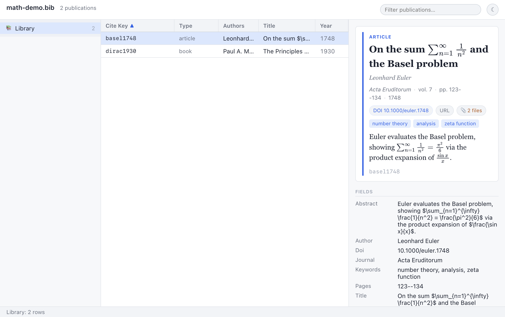
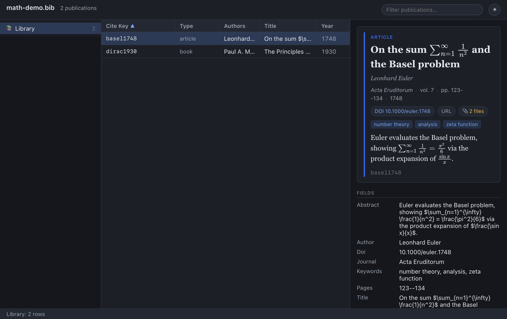

# Getting Started

Welcome to **Bibliophile**, a cross-platform bibliography manager for your
research libraries. It is a fresh, desktop rewrite of the classic
[BibDesk](https://bibdesk.sourceforge.io/), so if you have used BibDesk before
you will feel immediately at home — and if you have not, this chapter will get
you from "I have a `.bib` file" to "I am comfortably browsing, searching, and
editing it" in one sitting.

This chapter explains what the application is and the philosophy behind it,
which platforms it runs on, how to open a library, every part of the main
window, how the light/dark theme works, and a guided first-session walkthrough.
It closes with a *Map of this manual* that points you to every other Help page.

> **Tip:** If you just want to get going, jump to *Your first session* below; it
> is a complete, hands-on walkthrough. The reference material before it explains
> *why* things work the way they do, which is worth reading once you are
> oriented.

## 1.1 What this application is

Bibliophile is a **BibTeX library manager**. You point it at a `.bib` file
and it gives you a friendly, three-pane window for browsing, searching,
grouping, editing, annotating, and citing your references. It is built with
Electron, so the same application runs on macOS, Windows, and Linux from a
single codebase.

It is helpful to understand the four ideas that shape the whole design.

### 1.1.1 Your `.bib` file is the single source of truth

There is **no hidden database** holding your library hostage. The application
reads your plain-text `.bib` file directly into memory, lets you work on it, and
writes that same file back out when you save. Everything that defines your
library — entries, `@string` macros, an optional `@preamble`, your saved groups,
and file attachments — lives *inside* the `.bib` file (or in BibDesk's own
`@comment` blocks within it). Nothing important is stored in a separate
application-private store that could drift out of sync or be lost if you move
the file.

A direct, practical consequence: you can keep your `.bib` under version control
(Git, etc.), sync it with Dropbox/iCloud, email it to a colleague, or feed it to
`bibtex`/`biber`, and it remains a perfectly ordinary BibTeX file the whole
time.

> **Note:** Because the file *is* the library, "where is my data?" always has
> the same answer — it is the `.bib` file you opened. The document name shown in
> the window header is simply the file's base name.

### 1.1.2 Round-trip fidelity

The application reproduces BibDesk's exact on-disk format. Its custom BibTeX
parser and serializer are *byte-faithful*: they have been proven against a
golden test corpus, including a real BibDesk-authored file, to read and re-write
the following without mangling anything:

- `@string` macros and an `@preamble`,
- BibDesk's `@bibdesk_info` document-info block,
- the Static / Smart / URL / Script group `@comment` blocks (stored as Apple
  XML property lists), and
- `Bdsk-File-N` file-attachment blobs (base64-encoded binary property lists).

Field names are normalised, fields are sorted in BibDesk's canonical order, and
values are emitted in BibDesk's exact wrapping style. The upshot is that a file
you open and save here can be opened by BibDesk itself — and vice versa — with
no surprises.

> **Tip:** When you save, the application writes atomically (to a temporary file
> that is then renamed into place) and keeps a backup of the previous version as
> `yourfile.bib.bak`. See [Editing entries](03-editing-entries.md) for the full
> save story.

### 1.1.3 Interoperability with BibDesk and the TeX ecosystem

Because the format is faithful, Bibliophile is designed to live *alongside*
your existing tools rather than to replace them. You can edit the same library
in BibDesk on a Mac and in Bibliophile on another machine, cite it from a
LaTeX document with `\cite{...}`, run it through `bibtex` or `biber`, and pass
it between collaborators — all without conversion steps.

### 1.1.4 The goal: richer, more beautiful views

While staying faithful to the file format, the application aims to give you
*richer views* of your references than a plain text editor or a bare table ever
could. The detail pane renders a typeset entry card with proper typography,
clickable links, keyword tags, **rendered mathematics** (via MathJax) in titles
and abstracts, **Markdown** abstracts and notes, and **formatted citations** in
common styles (APA, Vancouver, Harvard). The presentation is themeable and
supports a full dark mode. See [Preview & citations](06-preview-and-citations.md)
and [Notes & abstracts](05-notes-and-abstracts.md).

## 1.2 Supported platforms

Bibliophile is a cross-platform Electron application. The core library code
is platform-agnostic (it does not depend on any operating-system feature), and
the desktop shell runs on:

- **macOS**
- **Windows**
- **Linux**

Throughout this manual, keyboard shortcuts are written for both conventions —
for example **Cmd+S** on macOS and **Ctrl+S** on Windows/Linux. Wherever you see
"Cmd/Ctrl", use whichever modifier your platform uses.

## 1.3 Opening a library

A *library* is simply a `.bib` file. There are several ways to open one.

### 1.3.0 The welcome screen

When you launch the app with no library open, you see a **welcome screen**: the
BibDesk name and two buttons — **Open a Bibliography…** (choose an existing
`.bib`) and **New Bibliography** (create an empty one — you pick where to save
it, then it opens ready for entries). You can also **drag a `.bib` file onto the
window** to open it. Once a library is open, the welcome screen is replaced by
the normal three-pane view.

### 1.3.1 From the File menu (the usual way)

1. Choose **File → Open** from the application menu (or **⌘O** / **Ctrl+O**).
2. In the file dialog, navigate to your `.bib` file and select it.
3. The window populates with your references.

That is all there is to it. The application reads the file as UTF-8 text, parses
it, and shows you the result.

### 1.3.2 Automatically on launch

The application can open a library *automatically* when it starts up — for
example, when a `.bib` file is handed to it by the operating system as it
launches (such as a file you double-clicked or dropped onto the application).
When this happens you arrive directly at a populated window with no menu step.

### 1.3.3 Advanced: launch with a specific file

Two mechanisms let you tell the application which library to open at startup.
Most people never need these, but they are handy for scripting and for opening a
library from a terminal.

| Mechanism | How | Example |
| --- | --- | --- |
| Command-line argument | Pass the `.bib` path when launching the app | *(launch the app with the path as its argument)* |
| `BIBDESK_OPEN` env var | Set it to an **absolute** path before launch | `BIBDESK_OPEN=/abs/path/to/library.bib` |

```bash
# Developer-mode launch (from a checkout), opening a library on startup:
BIBDESK_OPEN=/Users/me/research/library.bib pnpm --filter @bibdesk/app dev
```

> **Note:** `BIBDESK_OPEN` must be an **absolute** path. A small demo library,
> `docs/math-demo.bib`, ships with the project and is useful for seeing the
> MathJax preview and the dynamic category groups in action.

> **Warning:** The application currently reads `.bib` files as **UTF-8**. If your
> file was saved in a different text encoding, non-ASCII characters may not be
> read correctly. Re-saving the file as UTF-8 (for instance from BibDesk or a
> text editor) resolves this. Encoding auto-detection is on the roadmap.

## 1.4 The window at a glance

Above everything sits the **application menu bar** (the **BibDesk** /
**File** / **Edit** / **Publication** / **View** / **Window** / **Help** menus —
on macOS this lives in the system menu bar at the top of the screen; on Windows
and Linux it is attached to the window). The menus hold every command in the app,
each with its keyboard shortcut where it has one. The most-used commands are
*also* reachable from the toolbar, but the menu bar is the complete inventory. The
full menu-and-shortcut reference is in
[Shortcuts & reference](09-shortcuts-and-reference.md).

Once a library is open, the window itself is organised into a header, a toolbar,
three side-by-side panes, and a status-bar footer.


The overall layout looks like this:

```
┌───────────────────────────────────────────────────────────────────────────┐
│ HEADER:  library.bib   123 publications        [Filter publications…]  ☾/☀ │
├───────────────────────────────────────────────────────────────────────────┤
│ TOOLBAR: ＋ New  ⧉ Duplicate  🗑 Delete  ····  🌐 Online…  @string…  Save • │
├───────────────┬───────────────────────────────────┬───────────────────────┤
│ GROUPS        │ PUBLICATIONS TABLE                │ DETAIL / PREVIEW PANE  │
│ (sidebar)     │                                   │                        │
│               │ Cite Key │ Type │ Authors │ Title │  ┌──────────────────┐  │
│ 📚 Library    │ ─────────┼──────┼─────────┼────── │  │  ARTICLE         │  │
│ 📁 To read    │ einstein…│ arti…│ A. Eins…│ On t… │  │  On the Electro… │  │
│ ⚙ Recent      │ ……       │ …    │ …       │ …     │  │  A. Einstein     │  │
│ 🏷 Keywords    │          │      │         │       │  │  Ann. Phys.·1905 │  │
│   👤 Authors  │          │      │         │       │  │  [DOI] [URL] 📎   │  │
│               │          │      │         │       │  └──────────────────┘  │
├───────────────┴───────────────────────────────────┴───────────────────────┤
│ FOOTER:  Library: 123 rows                                                  │
└───────────────────────────────────────────────────────────────────────────┘
```

The three panes flow left to right in the way you naturally work: **pick a
scope** on the left, **find an entry** in the middle, **read or edit it** on the
right.

### 1.4.1 The header

The header runs across the very top of the window and contains, from left to
right:

| Element | What it shows / does |
| --- | --- |
| **Document name** | The base name of the open `.bib` file (e.g. `library.bib`). When no library is open it reads `BibDesk`. |
| **Publication count** | The total number of entries in the file, e.g. "123 publications" (or "1 publication" in the singular). |
| **Parse-warnings badge** | Appears only when the file produced warnings while loading, e.g. "⚠ 3 parse warnings". Absent on a clean load. |
| **Search box** | A live filter labelled *Filter publications…* (top-right). See [Browsing & searching](02-browsing-and-searching.md). It is hidden until a library is open. |
| **Theme toggle** | The **☾** (moon) / **☀** (sun) button. See *Light and dark themes* below. |

### 1.4.2 The toolbar

Just below the header is a row of quick-action buttons. The toolbar appears only
when a library is open. From left to right:

| Button | Action | Notes |
| --- | --- | --- |
| **＋ New** | Add a new entry to the library. | Creates an `article` entry with a unique placeholder cite key, selects it, and marks the document dirty. |
| **⧉ Duplicate** | Copy the selected entry. | Disabled until you select a row. The copy gets a `…-copy` cite key (made unique). |
| **🗑 Delete** | Remove the selected entry. | Disabled until you select a row. |
| *(spacer)* | — | Pushes the remaining buttons to the right. |
| **🌐 Online…** | Search online databases and import results. | Opens the online-search dialog. See [Online search](08-online-search.md). |
| **@string…** | Edit the library's `@string` macros. | Opens the macro editor. See [Editing entries](03-editing-entries.md). |
| **Save** | Write changes to disk. | See below. Also bound to **Cmd/Ctrl+S**. |

The **Save** button doubles as your unsaved-changes indicator:

| State | Label | Meaning |
| --- | --- | --- |
| Clean | **Saved** | Everything on disk matches what is in the window; the button is disabled. |
| Dirty | **Save •** | You have unsaved edits (the bullet flags them); click to write them out. |
| Saving | **Saving…** | A save is in progress. |

> **Note:** "New" and "Duplicate" change the entry *in memory*; the file on disk
> is unchanged until you actually **Save**. The same is true of every edit.

### 1.4.3 The three panes

The body of the window is a three-column layout.

- **Groups sidebar (left).** Your **📚 Library** (everything), plus any saved
  Static/Smart/URL/Script groups read from the file, plus the dynamic **Authors**
  and **Keywords** category sections computed automatically from your entries.
  Click a group to scope the table to it. Covered in depth in
  [Browsing & searching](02-browsing-and-searching.md).
- **Publications table (center).** One row per reference, with sortable columns
  for **Cite Key**, **Type**, **Authors**, **Title**, and **Year**. Click a
  column header to sort; click a row to inspect it. The table is *virtualized*,
  so it stays fast with thousands of entries. Covered in depth in
  [Browsing & searching](02-browsing-and-searching.md).
- **Detail / preview pane (right).** A typeset card for the selected entry plus
  an editable field list. It shows the title, authors, venue line, keyword tags,
  DOI/URL/attachment chips, a rendered abstract, rendered math, notes, and a
  formatted citation — and it is also where you edit fields, the cite key, and
  the entry type. See [Editing entries](03-editing-entries.md),
  [Attachments](04-attachments.md), [Notes & abstracts](05-notes-and-abstracts.md),
  and [Preview & citations](06-preview-and-citations.md).

### 1.4.4 The status bar (footer)

The footer along the bottom always tells you **what you are looking at**: the
name of the current group (if one other than the whole Library is selected) and
the row count. The count adapts to your live search — for example:

- `Library: 123 rows` — the whole library, no search.
- `To read: 8 rows` — a group is selected, no search.
- `42 of 123 rows` — a live-search filter is narrowing the visible rows.

It also briefly shows `Loading…` while publications are loading and, if
something goes wrong, an `Error: …` message.

## 1.5 Light and dark themes

There are three ways to set the appearance, and they all change the same
preference:

- The **☾ / ☀** button in the header toggles between light and dark. In **light**
  mode the button shows the **☾** moon (click it to go dark); in **dark** mode it
  shows the **☀** sun (click it to go light).
- **View → Toggle Light / Dark Theme** (**⌘⇧L** / **Ctrl+Shift+L**) does the same
  thing from the menu bar.
- **Preferences → Appearance → Theme** offers three explicit choices:
  **System**, **Light**, and **Dark**. The **System** setting (the default)
  follows your operating system's light/dark mode automatically, switching with
  it; **Light** and **Dark** pin the appearance regardless of the OS.





### 1.5.1 How the theme is stored

Your choice is **persisted with the application's other preferences** (in a
`settings.json` file in the per-user application-data folder), so:

- The application reopens in the theme you last used (and **System** keeps
  tracking the OS afterwards).
- The theme is a **per-installation, application-wide** preference — it is *not*
  written into your `.bib` file, so switching themes never marks your document
  dirty and never changes a single byte of your library.

Internally the theme is applied by setting `data-theme="dark"` (or `light`) on
the document's root element, which flips a set of CSS variables; the preview
card, table, and sidebar all re-colour together.

> **Tip:** Dark mode is genuinely dark, including the typeset preview card and
> the MathJax-rendered equations, so it is comfortable for long reading sessions.

## 1.6 Your first session

Here is an end-to-end walkthrough to get you comfortable. It assumes you have a
`.bib` file to hand; if not, you can use the bundled `docs/math-demo.bib`.

1. **Open your library.** Choose **File → Open** and select your `.bib` file (or
   launch with `BIBDESK_OPEN=/abs/path/library.bib`). The header now shows the
   file name and a publication count.
2. **Get the lay of the land.** Look at the left sidebar. Click **📚 Library** to
   confirm you are seeing everything; the footer reads `Library: N rows`.
3. **Browse the table.** Scroll the center pane. Click the **Title** header to
   sort alphabetically by title; click it again to reverse the order. Notice the
   small **▲ / ▼** arrow that marks the active sort column.
4. **Find something with live search.** Click the **Filter publications…** box in
   the header and type an author's surname or a word from a title — say
   `quantum`. The table narrows instantly and the footer updates to `M of N
   rows`. Clear the box to show everything again.
5. **Inspect an entry.** Click a row. The right-hand pane fills with a typeset
   card: title, authors, the venue line, keyword tags, any DOI/URL/attachment
   chips, the abstract, and a formatted citation. If the entry has math in its
   title or abstract, it is rendered with MathJax.
6. **Narrow by a category.** Back in the sidebar, expand the **Authors** or
   **Keywords** section and click one of its entries. The table now shows only
   the entries that use that author or keyword, and the footer shows the group
   name and count. You can *combine* this with the search box to filter within
   the group.
7. **Make a small edit.** With an entry selected, edit a field in the detail
   pane (for example, fix a typo in the title). The **Save** button changes to
   **Save •** to show you have unsaved changes.
8. **Save.** Press **Cmd/Ctrl+S** (or click **Save •**). The application writes
   your `.bib` atomically and keeps a `.bib.bak` backup of the previous version;
   the button returns to **Saved**.

That is the full loop: *open → scope → find → read → edit → save*. Every other
chapter of this manual goes deeper into one part of it.

## 1.7 Map of this manual

| Chapter | What it covers |
| --- | --- |
| **[1. Getting started](01-getting-started.md)** | This chapter: what the app is, opening a library, the window anatomy, themes, and a first-session walkthrough. |
| **[2. Browsing & searching](02-browsing-and-searching.md)** | The publications table (configurable columns, the icon columns, sorting, virtualization, selection), the live search filter, **Find Duplicates**, and the groups sidebar (Library, Static/Smart groups, and the dynamic Author/Keyword categories). |
| **[3. Editing entries](03-editing-entries.md)** | Editing fields (with autocomplete), cite keys, and entry types in the detail pane; adding, duplicating, and deleting entries; generating cite keys; **Find & Replace**; the **Copy** commands and cite drag-out; the `@string` macro editor; crossref inheritance; and saving with backups. |
| **[4. Attachments](04-attachments.md)** | Attaching, opening (in your OS default apps), and removing files (`Bdsk-File-N` blobs); the **Links** section for `Url`/`Doi`; how attachment paths are stored relative to the document; and **AutoFile** into a Papers folder. |
| **[5. Notes & abstracts](05-notes-and-abstracts.md)** | Writing abstracts and per-entry notes in Markdown, and the `[[citeKey]]` cross-reference links between entries. |
| **[6. Preview & citations](06-preview-and-citations.md)** | The typeset preview card, entry-type colour coding, keyword tags, MathJax math, clickable links, formatted CSL citations (APA/Vancouver/Harvard), and the clipboard copy commands. |
| **[7. Importing & exporting](07-importing-and-exporting.md)** | Pasting BibTeX, drag-and-drop, importing BibTeX/RIS files, and exporting to BibTeX/RIS/CSV/HTML. |
| **[8. Online search](08-online-search.md)** | Searching online databases inside the app and importing results as new entries. |
| **[9. Shortcuts & reference](09-shortcuts-and-reference.md)** | The full menu bar, keyboard shortcuts, how your data is stored, and current limitations and troubleshooting. |

## See also

- [Browsing & searching](02-browsing-and-searching.md) — your next stop: finding
  your way around an open library.
- [Editing entries](03-editing-entries.md) — when you are ready to change things.
- [Shortcuts & reference](09-shortcuts-and-reference.md) — the quick-reference
  card and troubleshooting.
