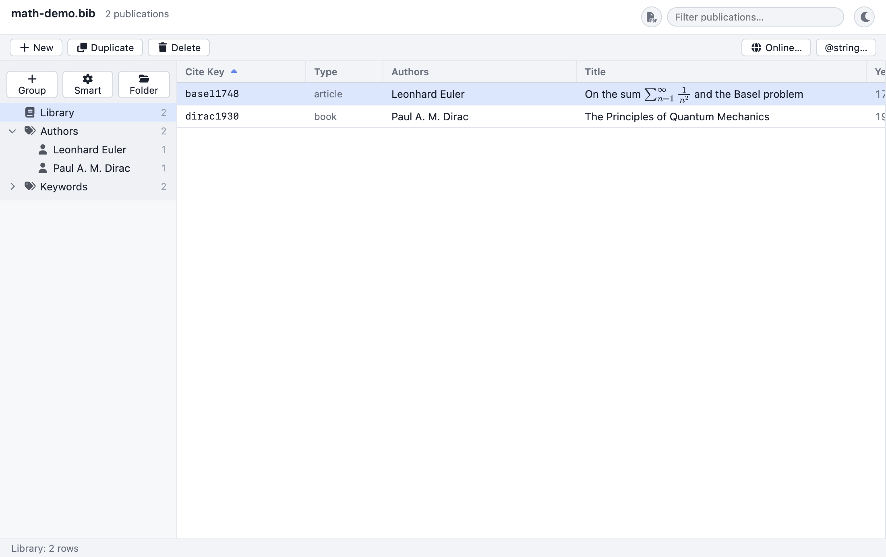
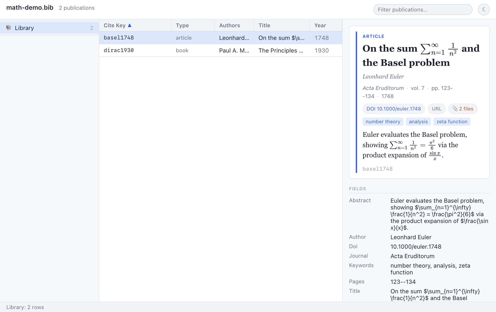
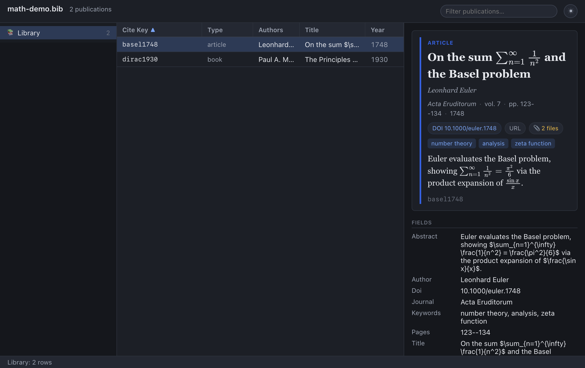

# Getting Started

Welcome to **Bibliofile**, a cross-platform bibliography manager for your
research libraries. It is a fresh, desktop rewrite of the classic
[BibDesk](https://bibdesk.sourceforge.io/), so if you have used BibDesk before
you will feel immediately at home — and if you have not, this chapter will get
you from "I have a `.bib` file" to "I am comfortably browsing, searching, and
editing it" in one sitting.

This chapter explains what the application is and the philosophy behind it,
which platforms it runs on, how to open a library, every part of the main
window, how the light/dark theme works, and a guided first-session walkthrough.
It closes with a *Map of this manual* that points you to every other Help page.

> **Tip:** If you just want to get going, jump to *Your first session* below; it
> is a complete, hands-on walkthrough. The reference material before it explains
> *why* things work the way they do, which is worth reading once you are
> oriented.

## 1.1 What this application is

Bibliofile is a **BibTeX library manager**. You point it at a `.bib` file
and it gives you a friendly, three-pane window for browsing, searching,
grouping, editing, annotating, and citing your references. It is built with
Electron, so the same application runs on macOS, Windows, and Linux from a
single codebase.

It is helpful to understand the four ideas that shape the whole design.

### 1.1.1 Your `.bib` file is the single source of truth

There is **no hidden database** holding your library hostage. The application
reads your plain-text `.bib` file directly into memory, lets you work on it, and
writes that same file back out when you save. Everything that defines your
library — entries, `@string` macros, an optional `@preamble`, your saved groups,
and file attachments — lives *inside* the `.bib` file (or in BibDesk's own
`@comment` blocks within it). Nothing important is stored in a separate
application-private store that could drift out of sync or be lost if you move
the file.

The one thing the app does keep outside your library is a *search cache* holding
the text it has extracted from your PDFs, so that full-text search does not have
to re-read every file. It contains no library data, and it is re-derived from the
PDFs themselves whenever it is missing or out of date — deleting it costs you
nothing but the time to rebuild it. See
[Browsing & searching](02-browsing-and-searching.md).

A direct, practical consequence: you can keep your `.bib` under version control
(Git, etc.), sync it with Dropbox/iCloud, email it to a colleague, or feed it to
`bibtex`/`biber`, and it remains a perfectly ordinary BibTeX file the whole
time.

> **Note:** Because the file *is* the library, "where is my data?" always has
> the same answer — it is the `.bib` file you opened. The document name shown in
> the window header is simply the file's base name.

### 1.1.2 Round-trip fidelity

The application reproduces BibDesk's exact on-disk format. Its custom BibTeX
parser and serializer are checked against a golden test corpus: a file already
written in BibDesk's canonical form is read and re-written **byte for byte
identically**, including:

- `@string` macros and an `@preamble`,
- BibDesk's `@bibdesk_info` document-info block,
- the Static / Smart / URL / Script group `@comment` blocks (stored as Apple
  XML property lists), and
- `Bdsk-File-N` file-attachment blobs (base64-encoded binary property lists).

A file that is *not* already in that form — one from another tool, or from a very
old BibDesk — is rewritten into it on the first save: field names are normalised,
fields are sorted in BibDesk's canonical order, values are emitted in BibDesk's
exact wrapping style, and BibDesk's own header lines are refreshed. Your content
survives; the formatting is canonicalised. The upshot is that a file you open and
save here can be opened by BibDesk itself — and vice versa — with no surprises.

> **Tip:** When you save, the application writes atomically (to a temporary file
> that is then renamed into place) and keeps a backup of the previous version as
> `yourfile.bib.bak`. It also refuses to silently overwrite a file that has been
> changed on disk behind its back — see *When the file has changed on disk* at the
> end of this chapter. For the full save story see
> [Editing entries](03-editing-entries.md).

### 1.1.3 Interoperability with BibDesk and the TeX ecosystem

Because the format is faithful, Bibliofile is designed to live *alongside*
your existing tools rather than to replace them. You can edit the same library
in BibDesk on a Mac and in Bibliofile on another machine, cite it from a
LaTeX document with `\cite{...}`, run it through `bibtex` or `biber`, and pass
it between collaborators — all without conversion steps.

### 1.1.4 The goal: richer, more beautiful views

While staying faithful to the file format, the application aims to give you
*richer views* of your references than a plain text editor or a bare table ever
could. The detail pane renders a typeset entry card with proper typography,
clickable links, keyword tags, **rendered mathematics** (via MathJax) in titles
and abstracts, **Markdown** abstracts and notes, and **formatted citations** in
common styles (APA, Vancouver, Harvard). The presentation is themeable and
supports a full dark mode. See [Preview & citations](06-preview-and-citations.md)
and [Notes & abstracts](05-notes-and-abstracts.md).

## 1.2 Supported platforms

Bibliofile is a cross-platform Electron application. The core library code
is platform-agnostic (it does not depend on any operating-system feature), and
the desktop shell runs on:

- **macOS**
- **Windows**
- **Linux**

Throughout this manual, keyboard shortcuts are written for both conventions,
macOS first — for example **⌘S** / **Ctrl+S**. **⌘** is the macOS Command key
(**Ctrl** on Windows and Linux), **⇧** is Shift, and **⌥** is Option/Alt, so
**⌥⌘S** / **Alt+Ctrl+S** means Option+Command+S or Alt+Ctrl+S.

## 1.3 Opening a library

A *library* is simply a `.bib` file. There are several ways to open one.

### 1.3.0 The welcome screen

When you launch the app with no library open, you see a **welcome screen**: a
📚 logo, the **Bibliofile** name, the line *A bibliography manager for BibTeX
libraries.*, and two buttons — **Open a Bibliography…** (choose an existing
`.bib`) and **New Bibliography** (create an empty one — you pick where to save it,
an empty file is written there, and it opens ready for entries). Below them is the
reminder that you can also **drag a `.bib` file onto the window** to open it.
Once a library is open, the welcome screen is replaced by the normal view.

### 1.3.1 From the File menu (the usual way)

1. Choose **File → Open…** from the menu bar (or press **⌘O** / **Ctrl+O**).
2. In the file dialog, navigate to your `.bib` file and select it.
3. The window populates with your references.

That is all there is to it. The application reads the file, parses it, and shows
you the result.

**Each library gets its own window.** If the window you are in is still showing
the welcome screen, the library opens into it; otherwise a new window appears, so
you can have several libraries open side by side. Opening a file that is *already*
open just brings its window to the front rather than loading it twice. Use the
**Window** menu to move between them.

> **Tip:** To experiment on a library without risking it, use
> **File → Clone Bibliography…**: a complete copy — the `.bib` plus copies of
> every file it links — opened in its own window, with the original untouched.
> See [Importing & exporting → Cloning a bibliography](07-importing-and-exporting.md#766-cloning-a-bibliography).

### 1.3.2 Automatically on launch

The application can open a library *automatically* when it starts up — for
example, when a `.bib` file is handed to it by the operating system as it
launches (such as a file you double-clicked or dropped onto the application).
When this happens you arrive directly at a populated window with no menu step.

### 1.3.3 Advanced: launch with a specific file

Two mechanisms let you tell the application which library to open at startup.
Most people never need these, but they are handy for scripting and for opening a
library from a terminal.

| Mechanism | How | Example |
| --- | --- | --- |
| Command-line argument | Pass the `.bib` path when launching the app | *(launch the app with the path as its argument)* |
| `BIBDESK_OPEN` env var | Set it to an **absolute** path before launch | `BIBDESK_OPEN=/abs/path/to/library.bib` |

```bash
# Developer-mode launch (from a checkout), opening a library on startup:
BIBDESK_OPEN=/Users/me/research/library.bib pnpm --filter @bibdesk/app dev
```

> **Note:** `BIBDESK_OPEN` must be an **absolute** path. A small demo library,
> `docs/math-demo.bib`, ships with the project and is useful for seeing the
> MathJax preview and the dynamic category groups in action.

> **Note:** The application **auto-detects** each `.bib` file's text encoding — a
> byte-order mark first, then UTF-8, falling back to Windows-1252 / Latin-1 — so
> files saved by BibDesk or other tools read correctly without manual conversion.
> If an 8-bit file is guessed wrong, re-read it under the right encoding (or
> **Convert to UTF-8**) from the **File → Text Encoding** submenu; saves also warn
> before they would drop a character the current encoding can't represent.

## 1.4 The window at a glance

Above everything sits the **application menu bar**: **File** / **Edit** /
**Publication** / **Tools** / **View** / **Window** / **Help**. On macOS it lives
in the system menu bar at the top of the screen and is preceded by the
**Bibliofile** application menu (About, **Preferences… ⌘,**, Quit); on Windows and
Linux there is no application menu — the menu bar is attached to the window, and
**Preferences…** and **Quit** sit at the bottom of the **File** menu instead. The
menus hold every command in the app, each with its keyboard shortcut where it has
one. The most-used commands are *also* reachable from the toolbar, but the menu
bar is the complete inventory. The full menu-and-shortcut reference is in
[Shortcuts & reference](09-shortcuts-and-reference.md).

Once a library is open, the window itself is organised into a header, a toolbar,
three side-by-side panes, and a status-bar footer.



The overall layout looks like this:

```
┌───────────────────────────────────────────────────────────────────────────┐
│ HEADER:  library.bib •  123 publications   📄 [Filter publications…]   ☾/☀ │
├───────────────────────────────────────────────────────────────────────────┤
│ TOOLBAR: ＋ New  ⧉ Duplicate  🗑 Delete  ········  🌐 Online…    @string…   │
├───────────────┬───────────────────────────────────┬───────────────────────┤
│ GROUPS        │ PUBLICATIONS TABLE                │ DETAIL / PREVIEW PANE  │
│ (sidebar)     │                                   │                        │
│               │ Cite Key │ Type │ Authors │ Title │  ┌──────────────────┐  │
│ 📚 Library    │ ─────────┼──────┼─────────┼────── │  │  ARTICLE         │  │
│ 📁 To read    │ einstein…│ arti…│ A. Eins…│ On t… │  │  On the Electro… │  │
│ ⚙ Recent      │ ……       │ …    │ …       │ …     │  │  A. Einstein     │  │
│ 🏷 Keywords    │          │      │         │       │  │  Ann. Phys.·1905 │  │
│   👤 Authors  │          │      │         │       │  │  [DOI] [URL] 📎   │  │
│               │          │      │         │       │  └──────────────────┘  │
├───────────────┴───────────────────────────────────┴───────────────────────┤
│ FOOTER:  Library: 123 rows                                                  │
└───────────────────────────────────────────────────────────────────────────┘
```

The three panes flow left to right in the way you naturally work: **pick a
scope** on the left, **find an entry** in the middle, **read or edit it** on the
right.

### 1.4.1 The header

The header runs across the very top of the window and contains, from left to
right:

| Element | What it shows / does |
| --- | --- |
| **Document name** | The base name of the open `.bib` file (e.g. `library.bib`). With no library open you get the welcome screen instead of this header. |
| **Unsaved-changes marker** | A **•** immediately after the file name when you have edits that are not on disk yet; it reads *(saving…)* while a save is running. See below. |
| **Publication count** | The total number of entries in the file, e.g. "123 publications" (or "1 publication" in the singular). |
| **Parse-warnings badge** | Appears only when the file produced warnings while loading, e.g. "⚠ 3 parse warnings". Absent on a clean load. |
| **Search box** | A live filter labelled *Filter publications…*, with a small **PDF** button beside it that widens the search to the text inside your attached PDFs. See [Browsing & searching](02-browsing-and-searching.md). |
| **Theme toggle** | The **☾** (moon) / **☀** (sun) button. See *Light and dark themes* below. |

The dot beside the file name is your unsaved-changes indicator:

| State | Header shows | Meaning |
| --- | --- | --- |
| Clean | `library.bib` | Everything on disk matches what is in the window. |
| Dirty | `library.bib •` | You have unsaved edits. Hovering the dot says *Unsaved changes — press ⌘S to save*. |
| Saving | `library.bib (saving…)` | A save is in progress. |

### 1.4.2 The toolbar

Just below the header is a row of quick-action buttons. The toolbar appears only
when a library is open. From left to right:

| Button | Action | Notes |
| --- | --- | --- |
| **＋ New** | Add a new entry to the library. | Creates an entry of your **default entry type** (`article` unless you change it in Preferences) with the placeholder cite key `untitled`, made unique, and marks the document dirty. |
| **⧉ Duplicate** | Copy the selected entry. | Disabled until you select a row. The copy gets a `…-copy` cite key (made unique). |
| **🗑 Delete** | Remove the selected entry. | Disabled until you select a row. |
| *(spacer)* | — | Pushes the remaining buttons to the right. |
| **🌐 Online…** | Search online databases and import results. | Opens the online-search dialog. See [Online search](08-online-search.md). |
| **@string…** | Edit the library's `@string` macros. | Opens the macro editor. See [Editing entries](03-editing-entries.md). |

There is no Save button: save with **⌘S** / **Ctrl+S** or **File → Save**, and
watch the header for the unsaved-changes dot.

> **Note:** "New" and "Duplicate" change the entry *in memory*; the file on disk
> is unchanged until you actually save. The same is true of every edit.

### 1.4.3 The three panes

The body of the window is a three-column layout.

- **Groups sidebar (left).** Your **📚 Library** (everything), plus any saved
  Static/Smart/URL/Script groups read from the file, the **folders** you have
  filed them into, and the dynamic **Authors** and **Keywords** category sections
  computed automatically from your entries. Click a group to scope the table to
  it. Covered in depth in [Browsing & searching](02-browsing-and-searching.md).
- **Publications table (center).** One row per reference. Out of the box the
  columns are **Cite Key**, **Type**, **Authors**, **Title**, **Year**, plus the
  keyword, attachment, and read icon columns — but the column set is yours to
  configure. Click a column header to sort; click a row to inspect it. The table
  is *virtualized*, so it stays fast with thousands of entries. Covered in depth
  in [Browsing & searching](02-browsing-and-searching.md).
- **Detail / preview pane (right).** A typeset, **read-only** card for the
  selected entry. It shows the title, authors, venue line, keyword tags,
  DOI/URL/attachment chips, a rendered abstract, rendered math, notes, and a
  formatted citation; its **Edit…** button (or a double-click on the row) opens
  the entry's editor window, which is where you change fields, the cite key, and
  the entry type. See [Editing entries](03-editing-entries.md),
  [Attachments](04-attachments.md), [Notes & abstracts](05-notes-and-abstracts.md),
  and [Preview & citations](06-preview-and-citations.md).

The three columns are the default arrangement, not a fixed one. You can drag
either divider to resize the groups sidebar or the right-hand pane, hide the
latter altogether (**View → Toggle Side
Panel**, **⌥⌘S** / **Alt+Ctrl+S**), swap it for the Claude assistant, and open a
fourth area — a **bottom panel** — under the table (**View → Toggle Bottom
Panel**, **⇧⌘B** / **Ctrl+Shift+B**). All of that is in
[Configurable panels](10-panels.md).

### 1.4.4 The status bar (footer)

The footer along the bottom always tells you **what you are looking at**: the
name of the group you have selected in the sidebar, followed by the row count.
The count adapts to your live search — for example:

- `Library: 123 rows` — the whole library, no search.
- `To read: 8 rows` — a group is selected, no search.
- `Library: 42 of 123 rows` — a live-search filter is narrowing the visible rows.

It also shows `Loading…` while publications are loading, progress and a summary
while a drag-and-drop import is running, and, if something goes wrong, an
`Error: …` message.

## 1.5 Light and dark themes

There are three ways to set the appearance, and they all change the same
preference:

- The **☾ / ☀** button in the header toggles between light and dark. In **light**
  mode the button shows the **☾** moon (click it to go dark); in **dark** mode it
  shows the **☀** sun (click it to go light).
- **View → Toggle Light / Dark Theme** (**⇧⌘L** / **Ctrl+Shift+L**) does the same
  thing from the menu bar.
- **Preferences → General → Appearance → Theme** offers three explicit choices:
  **System**, **Light**, and **Dark**. **System** (the default) takes its cue from
  your operating system's light/dark setting; **Light** and **Dark** pin the
  appearance regardless of the OS.

Note that the toggle button and the menu command always set an explicit **Light**
or **Dark** — using either of them takes you *out* of **System**. To go back,
choose **System** again in Preferences.





### 1.5.1 How the theme is stored

Your choice is **persisted with the application's other preferences** (in a
`settings.json` file in the per-user application-data folder), so:

- The application reopens in the theme you last used, and on **System** it
  re-reads your OS setting each time it starts. It does not, however, follow a
  live switch: if you change your operating system to dark mode while Bibliofile
  is already running, the window keeps the appearance it started with until you
  restart it or change any preference.
- The theme is a **per-installation, application-wide** preference — it is *not*
  written into your `.bib` file, so switching themes never marks your document
  dirty and never changes a single byte of your library.

Internally the theme is applied by setting `data-theme="dark"` (or `light`) on
the document's root element, which flips a set of CSS variables; the preview
card, table, and sidebar all re-colour together.

> **Tip:** Dark mode is genuinely dark, including the typeset preview card and
> the MathJax-rendered equations, so it is comfortable for long reading sessions.

## 1.6 Your first session

Here is an end-to-end walkthrough to get you comfortable. It assumes you have a
`.bib` file to hand; if not, you can use the bundled `docs/math-demo.bib`.

1. **Open your library.** Choose **File → Open…** and select your `.bib` file (or
   launch with `BIBDESK_OPEN=/abs/path/library.bib`). The header now shows the
   file name and a publication count.
2. **Get the lay of the land.** Look at the left sidebar. Click **📚 Library** to
   confirm you are seeing everything; the footer reads `Library: N rows`.
3. **Browse the table.** Scroll the center pane. Click the **Title** header to
   sort alphabetically by title; click it again to reverse the order. Notice the
   small **▲ / ▼** arrow that marks the active sort column.
4. **Find something with live search.** Click the **Filter publications…** box in
   the header and type an author's surname or a word from a title — say
   `quantum`. The table narrows instantly and the footer updates to
   `Library: M of N rows`. Clear the box to show everything again.
5. **Inspect an entry.** Click a row. The right-hand pane fills with a typeset
   card: title, authors, the venue line, keyword tags, any DOI/URL/attachment
   chips, the abstract, and a formatted citation. If the entry has math in its
   title or abstract, it is rendered with MathJax.
6. **Narrow by a category.** Back in the sidebar, expand the **Authors** or
   **Keywords** section and click one of its entries. The table now shows only
   the entries that use that author or keyword, and the footer shows the group
   name and count. You can *combine* this with the search box to filter within
   the group.
7. **Make a small edit.** With an entry selected, edit a field in the detail
   pane (for example, fix a typo in the title). A **•** appears next to the file
   name in the header to show you have unsaved changes.
8. **Save.** Press **⌘S** / **Ctrl+S** (or choose **File → Save**). The
   application writes your `.bib` atomically and keeps a `.bib.bak` backup of the
   previous version; the dot disappears.

That is the full loop: *open → scope → find → read → edit → save*. Every other
chapter of this manual goes deeper into one part of it.

### 1.6.1 When the file has changed on disk

Because your `.bib` is an ordinary text file, other things can write to it while
it is open here: another editor, a Git checkout, a Dropbox or rsync sync, a
`sed` script. The application will not quietly throw that away.

When it reads or writes your library it remembers the file's modification time
and size. If, at the moment you save, the file on disk no longer matches what it
last saw, it stops and asks — **This file has changed on disk** — offering three
choices:

| Choice | What happens |
| --- | --- |
| **Overwrite** | Your in-memory version is written out, replacing the external changes. |
| **Reload from Disk** | Your unsaved edits are discarded and the on-disk version is re-read into the window. |
| **Cancel** | Nothing is written and nothing is discarded, so you can go and look at the file first. This is the default — pressing Enter or Escape takes it. |

Two details worth knowing:

- **The check happens at save time, not continuously.** The application does not
  watch the file, so an external change made while you are working goes unnoticed
  until you save (or until you reload the file yourself with
  **File → Revert to Saved**).
- **When you are closing the window**, the same guard runs on the "Save changes
  before closing?" prompt, but with only **Overwrite** and **Cancel** — reloading
  makes no sense for a window that is going away. Cancel is again the default, and
  it keeps the window open (and cancels a quit that the close was part of).

**Save As…** to a *different* path is not guarded this way; the file dialog
already asks before replacing an existing file. And a save issued from a script —
which has no one to prompt — fails with an error naming the file rather than
overwriting it, so an automated run reports the conflict instead of hiding it.
See [Scripting with JavaScript](12-scripting.md).

> **Note:** The comparison is a modification-time-and-size check rather than a
> hash of the contents, so it is fast and never cries wolf — but it can, in rare
> cases, miss a change (an external edit of exactly the same byte length landing
> within the same clock tick). It is a safety net against the common accidents,
> not a guarantee.

## 1.7 Map of this manual

| Chapter | What it covers |
| --- | --- |
| **[1. Getting started](01-getting-started.md)** | This chapter: what the app is, opening a library, the window anatomy, themes, and a first-session walkthrough. |
| **[2. Browsing & searching](02-browsing-and-searching.md)** | The publications table (configurable columns, the icon columns, sorting, virtualization, selection), the live search filter and full-text PDF search, **Find Duplicates**, and the groups sidebar (Library, Static/Smart groups, folders, and the dynamic Author/Keyword categories). |
| **[3. Editing entries](03-editing-entries.md)** | Editing fields (with autocomplete), cite keys, and entry types in the entry's editor window; adding, duplicating, and deleting entries; generating cite keys; **Find & Replace**; the **Copy** commands and cite drag-out; the `@string` macro editor; crossref inheritance; undo/redo; and saving with backups. |
| **[4. Attachments](04-attachments.md)** | Attaching, opening (in your OS default apps), and removing files (`Bdsk-File-N` blobs); the **Links** section for `Url`/`Doi`; how attachment paths are stored relative to the document; **AutoFile** into a Papers folder; and **Publication → OCR Scanned PDFs…**, which adds a searchable text layer to scanned PDFs. |
| **[5. Notes & abstracts](05-notes-and-abstracts.md)** | Writing abstracts and per-entry notes in Markdown, and the `[[citeKey]]` cross-reference links between entries. |
| **[6. Preview & citations](06-preview-and-citations.md)** | The typeset preview card, entry-type colour coding, keyword tags, MathJax math, clickable links, formatted CSL citations (APA/Vancouver/Harvard), and the clipboard copy commands. |
| **[7. Importing & exporting](07-importing-and-exporting.md)** | Pasting BibTeX, drag-and-drop, importing BibTeX/RIS files, **File → Clone Bibliography…**, and exporting to BibTeX/RIS/CSV/HTML. |
| **[8. Online search](08-online-search.md)** | Searching online databases inside the app and importing results as new entries. |
| **[9. Shortcuts & reference](09-shortcuts-and-reference.md)** | The full menu bar, keyboard shortcuts, how your data is stored, and current limitations and troubleshooting. |
| **[10. Configurable panels](10-panels.md)** | Resizing, hiding, and switching the side and bottom panels; the Details / Claude side-panel contents; the Annotation, Tabbed, and LaTeX Preview bottom-panel modes; the multi-select view and the row context menu. |
| **[11. Customizing panels & outputs](11-customizing-panels.md)** | Designing your own panel and output templates with Handlebars: the context fields, helpers, live widgets, interactive hooks, and worked examples. |
| **[12. Scripting with JavaScript](12-scripting.md)** | Automating your library from the **Script Console**: the `bibliofile` API, saved scripts, file and network access, and worked examples. |

## See also

- [Browsing & searching](02-browsing-and-searching.md) — your next stop: finding
  your way around an open library.
- [Editing entries](03-editing-entries.md) — when you are ready to change things.
- [Shortcuts & reference](09-shortcuts-and-reference.md) — the quick-reference
  card and troubleshooting.
