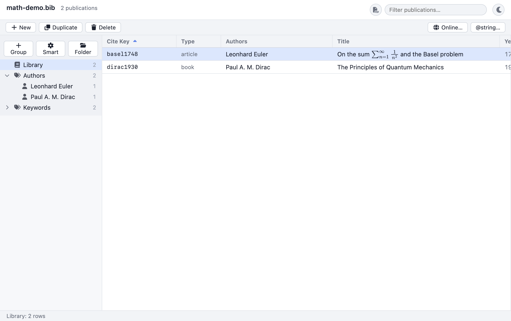

# Browsing & Searching

This chapter is about *finding your way around* an open library. It covers the
three tools you use to locate and focus on references: the **publications
table** in the center, the **live search** filter in the header, and the
**groups sidebar** on the left. It explains not only how to use each one, but how
each works underneath — what is matched, how sorting and counting behave, where
the groups come from, and how they combine — so that you can predict the
application's behaviour rather than guess at it.

If you have not opened a library yet, start with
[Getting started](01-getting-started.md).

## 2.1 How browsing works (the mental model)

Three independent controls determine which rows you see and in what order:

1. **The selected group** (sidebar) sets the *scope* — which subset of the
   library is in play (the whole Library, a saved group, or one author/keyword
   category).
2. **The live search** (header) applies a *text filter* within that scope.
3. **The sort** (table header) sets the *order* of whatever survives the first
   two.

The footer always reports the net result: the active group's name and the row
count, adjusted for any live search. Keeping this three-control model in mind
makes everything below predictable. The rest of the chapter takes each control
in turn.

## 2.2 The publications table

The center pane lists your references, one per row.



### 2.2.1 The columns

By default the table shows eight columns: five text columns and three compact
**icon** columns. Each text column is *derived* from your entry's BibTeX fields
and formatted for reading — the table never shows raw, brace-cluttered BibTeX.
The set of columns is **configurable** (see [§2.2.6](#226-configuring-the-columns)),
so you can add, remove, and reorder them; the defaults are:

| Column | What it shows | Where it comes from |
| --- | --- | --- |
| **Cite Key** | The entry's citation key, in a monospaced font. | The entry's BibTeX key, e.g. `einstein1905`. |
| **Type** | The entry type. | The BibTeX entry type, normalised to lower case, e.g. `article`, `book`, `inproceedings`. |
| **Authors** | A readable author list. | Parsed from the `Author` field (falling back to `Editor` when there are no authors); names are formatted and joined, with a trailing **et al.** when the field ended in `and others`. |
| **Title** | The title, cleaned for display. | The `Title` field, *de-TeXified* and stripped of BibTeX protective braces. |
| **Year** | The publication year. | The `Year` field. |
| **Keywords** (icon) | A 🔑 key icon when the entry has any keywords. | Non-empty `Keywords` field. |
| **Attachments** (icon) | A 📎 paperclip (with a small count badge if more than one) when the entry has attached files. | The entry's `Bdsk-File-N` attachments (and a `Local-Url`, if any). |
| **Read** (icon) | A checked box when the entry is marked read, an empty box when explicitly unread, nothing when unset. | The `Read` field (a tri-state value). |

A few details worth knowing about how the text values are produced:

- **De-TeXifying titles.** TeX escapes are converted to their Unicode
  equivalents and BibTeX *protective braces* are removed for display. For
  example a stored title `{C}alabi--{Y}au manifolds` is shown as
  `Calabi–Yau manifolds`, and `{{Higgs boson}}` is shown as `Higgs boson`. The
  brace-stripping is **math-aware**: braces inside a `$…$` or `$$…$$` math span
  are preserved, so a title like `The $\frac{1}{2}$-spin case` keeps its math
  intact.

  ```bibtex
  @article{nakahara,
    author = {Nakahara, Mikio},
    title  = {{C}alabi--{Y}au {M}anifolds and Mirror Symmetry},
    year   = {2003}
  }
  ```
  This entry appears in the table as **Cite Key** `nakahara`, **Type**
  `article`, **Authors** `Mikio Nakahara`, **Title**
  `Calabi–Yau Manifolds and Mirror Symmetry`, **Year** `2003`.

- **Author formatting and "et al."** Names from the `Author` field are parsed
  into their components and rendered in a consistent display form; multiple
  authors are joined with commas and a final "and" (e.g.
  `A. Einstein, B. Podolsky and N. Rosen`). If the field is written with
  `and others`, the display ends in **et al.** When an entry has no `Author`
  field, the `Editor` field is used instead.

> **Note:** The columns shown above are the *defaults*. You can change which
> columns appear, and their order, from the **View → Columns** menu or the
> Preferences "Columns" manager — see
> [§2.2.6](#226-configuring-the-columns). Any BibTeX field can be added as its
> own column.

### 2.2.2 Column widths

By default the **Cite Key**, **Type**, and **Year** columns have fixed widths and
do not shrink, so the narrow Year and Type columns never collapse or truncate,
while **Authors** and **Title** *grow* to absorb the remaining horizontal space.

**To resize a column**, drag its **right-hand edge** in the header (the cursor
turns into a resize arrow). Once you set a width by hand, that column keeps it —
the remaining growing columns take up any slack, and if you pin every column the
table left-packs them. Widths are remembered per column across launches.

### 2.2.3 Sorting

Click any **column header** to sort the table by that column.

- The **first click** on a header sorts **ascending** by that column.
- Clicking the **same header again** flips the direction to **descending**.
- A small **▲** (ascending) or **▼** (descending) arrow appears on the active
  column to show the current direction.
- Clicking a *different* header sorts by the new column, starting again at
  **ascending**.

The default sort, on first opening a library, is **Cite Key, ascending**.

#### How the sort behaves

Sorting is a **case-insensitive, numeric-aware string comparison**. Two practical
consequences:

- Case does not matter: `Apple` and `apple` sort together rather than in two
  separate alphabetical runs.
- Numeric runs sort by *value*, not by character. So years and numbered keys
  sort `2`, `9`, `10` rather than the naïve `10`, `2`, `9`.

Every column sorts as text by this rule, including **Year** — which is fine
because years are numeric strings and the numeric-aware comparison orders them
correctly.

> **Note:** Sorting on a single column at a time is supported today. Multi-column
> ("sort by year, then by author") sorting is planned but not yet available.

### 2.2.4 Virtualization (why the table stays fast)

The table is **virtualized**: only the rows currently visible in the viewport
(plus a small overscan buffer just above and below) are actually rendered into
the window. As you scroll, rows are recycled. This is why the table stays smooth
and responsive even with very large libraries of thousands — or tens of
thousands — of entries: the cost of drawing the table depends on the *size of the
window*, not on the *size of the library*.

The whole list is still loaded into memory and is fully searchable and sortable;
virtualization affects only what is drawn, not what is available.

> **Tip:** Because rows are recycled as you scroll, the scrollbar reflects the
> *full* list height — drag it to jump anywhere in a long library instantly.

### 2.2.5 Selection and viewing details

**Click a row** to select it. The selected row is highlighted, and its full
details load into the right-hand pane: a typeset entry card showing the title,
authors, venue, keyword tags, abstract, clickable DOI/URL/attachment links,
rendered math, notes, and a formatted citation. Selecting an entry is also the
gateway to editing it.

For everything you can see and do in that pane, see
[Preview & citations](06-preview-and-citations.md),
[Editing entries](03-editing-entries.md),
[Attachments](04-attachments.md), and
[Notes & abstracts](05-notes-and-abstracts.md).

> **Tip:** Notes can contain `[[citeKey]]` cross-reference links. Clicking one
> jumps the selection to the linked entry — and if that entry is not in the
> current group's view, the application automatically switches back to the full
> Library so it can be selected. See [Notes & abstracts](05-notes-and-abstracts.md).

> **Tip:** You can **drag a row out** of the table into a TeX editor (or any text
> field) to insert a `\cite{…}` command for that entry, and there are clipboard
> commands to copy the cite key, a `\cite{…}`, a formatted citation, or the
> entry's BibTeX. See
> [Editing entries → Copying entries](03-editing-entries.md#copying-entries-cite-keys-and-citations).

#### Color labels

**Right-click a row** for a Finder-style strip of color dots, and click one to
tag the entry — the whole row is then tinted that color (the click target is the
**×** to clear it). You can also use **Publication → Color Label**. The color
applies to the current selection, so you can tag several rows at once, and it's a
single undo step. The label is stored in the entry's `Bdsk-Color` field, so it
round-trips with BibDesk.

### 2.2.6 Configuring the columns

The table columns are not fixed: you can choose **which** fields appear, in
**what order**, and **how wide** they are.

#### Reorder by dragging the header

**Drag a column header sideways** onto another to reorder — drop it and it lands
just before the column you dropped onto. (A short click still sorts; a drag
reorders.) This is the quickest way to rearrange columns, and it replaces the old
up/down buttons. The new order is remembered across launches.

#### From the View → Columns menu (quick toggles)

**View → Columns** opens a checklist of common columns. Each item is a checkbox —
tick it to show that column, untick it to hide it. The menu offers the eight
default columns plus quick toggles for **Rating** (a ★ star column), **Journal**,
**Booktitle**, **Publisher**, **DOI**, **URL**, and **Month**, and it also lists
any custom field columns you have added. This is the fastest way to show or hide a
column on the fly.

#### From the Preferences "Columns" manager (show / hide / add)

Open **Preferences** (**⌘,** / **Ctrl+,**) and find the **Columns** section. It
lists your current columns, each with a **×** to **remove** it. Below the list, an
**Add column…** dropdown adds any of the built-in columns you do not yet have, and
an **"Add a field (e.g. Journal)"** text box lets you add **any BibTeX field name
at all** as a column — type the field name and press **Enter**. So if your entries
carry a custom `Funding` or `Project` field, you can surface it as a column.
(Reordering and resizing happen on the header itself — see above and
[§2.2.2](#222-column-widths).)

Your column configuration is saved with the application's other preferences (in
`settings.json`), so it persists across sessions and applies to every library you
open. It is *not* stored in any `.bib` file.

#### The icon columns

Three of the default columns are compact **icon** columns rather than text:

- **🔑 Keywords** — shows a key glyph when the entry has a non-empty `Keywords`
  field (these are the same keywords that drive the
  [Keywords category groups](#245-the-dynamic-author-and-keyword-categories) and
  the [preview tags](06-preview-and-citations.md)). The header is a key icon.
- **📎 Attachments** — shows a paperclip when the entry has attached files, with a
  small number badge when there is more than one. The count includes the entry's
  `Bdsk-File-N` attachments (see [Attachments](04-attachments.md)). The header is
  a paperclip icon.
- **✓ Read** — a tri-state read marker driven by the entry's `Read` field: a
  **filled, checked box** when the entry is marked read, an **empty box** when it
  is explicitly marked unread, and **nothing** when the field is absent. The
  header is a checked-box icon.
- **★ Rating** (not shown by default) — when you add the Rating column, it shows
  the entry's `Rating` field as that many filled stars (out of five).

> **Note:** The icon columns are **display-only indicators** — they reflect the
> underlying fields but you do not click them to toggle anything. To mark an entry
> read or rate it, set its `Read` or `Rating` field in the
> [editor](03-editing-entries.md#editing-fields) (`Read` uses values such as `1`
> for read; `Rating` is a number 0–5). The columns then update to match.

## 2.3 Live search

Use the **search box** at the top-right of the window — the one labelled
**"Filter publications…"** — to filter the table as you type.

1. Click in the search box (it appears only when a library is open).
2. Start typing.

The list narrows **instantly**, with no separate "search" button to press. Clear
the box to see everything again.

### 2.3.1 What is matched

The search queries an index of **all** of an entry's field text — the cite key,
type, authors, title, year, **and** the abstract, notes, keywords, and every
other field. So:

- Typing `quantum` finds the word in any **title**, abstract, or note.
- Typing an author's surname finds **their papers**.
- Typing `article` finds every entry of that **type**.
- Typing `2019` finds entries from that **year** — and also any field that
  happens to contain "2019".
- Typing part of a **cite key** (e.g. `einstein`) finds it directly.

Matching is **case-insensitive** (`QUANTUM`, `Quantum`, and `quantum` are
equivalent), results are **ranked by relevance** (best matches first), and terms
match by **word prefix**, so `bargain` finds *bargaining*. The index is an
in-memory, rebuildable cache (your `.bib` file stays the source of truth).

#### Including PDF contents (the PDF toggle)

By default the search looks only at the bibliographic **fields** above — *not*
the full text of attached PDFs. The round **PDF button** to the left of the
search box toggles **full-text search**: switch it on (it highlights) and the
search *also* matches the text extracted from attached PDFs, so a phrase from
inside a paper finds it.

This is off by default on purpose: PDF bodies mention many names and terms that
aren't really about the entry (an author's name printed in a paper's references,
say), so full-text search can return far more — and less relevant — results. Turn
it on when you're hunting for something you know is *inside* a paper; leave it off
for ordinary "find this reference" filtering. Your choice is remembered. (PDF text
is indexed in the background shortly after a library opens, so newly-opened
libraries gain PDF matches a moment later.)

> **Note (the substring fallback):** Full-text search relies on a native
> component. If it isn't available for your build, the box automatically falls
> back to a plain **case-insensitive substring filter** over the **visible text
> columns** only (no abstracts, notes, or PDF text) — still useful, just not
> full-text. In that mode `ein` matches both `Einstein` and `protein` (a literal
> substring, not a word). Developers can enable full-text search in a local build
> with `pnpm --filter @bibdesk/app rebuild:electron`.

### 2.3.2 The "N of M rows" footer

As you type, the footer updates to tell you how much of the library is showing.
The label has two forms:

| Footer label | Meaning |
| --- | --- |
| `123 rows` | No search (or the search matched everything); the count is the full set for the current group. |
| `42 of 123 rows` | A search is narrowing the rows: **42** match out of **123** in the current scope. |

If a group is selected, its name is prefixed, e.g. `To read: 8 of 40 rows`.

> **Tip:** The footer is the single most useful indicator in the window. It
> answers "what am I looking at right now?" at a glance — the group scope, the
> matched count, and the total.

## 2.4 The groups sidebar

The left pane lets you focus on a *slice* of your library. Click any group to
scope the table to it; the footer then shows the group's name and row count.


### 2.4.1 The kinds of group

The sidebar can show several kinds of group, each with its own icon. Some are
read from the `.bib` file; others are computed automatically.

| Icon | Kind | Source | What it is |
| --- | --- | --- | --- |
| 📚 | **Library** | Synthetic | Everything in the file. Always present at the top. Selecting it clears any group scope. |
| 📁 | **Static** | From the file | A hand-picked set of entries (BibDesk Static group). Membership is an explicit list of cite keys. |
| ⚙ | **Smart** | From the file | A rule-based group (BibDesk Smart group). Membership is computed from a saved set of conditions. |
| 🏷 | **Category** | Computed | A category *section* heading (the **Keywords** section), and individual keyword values. |
| 👤 | **Author** | Computed | An individual author value under the **Authors** section. |
| 🔗 | **URL** | From the file | A BibDesk URL group. Stored for fidelity but type-only here (see caveat below). |
| 📜 | **Script** | From the file | A BibDesk Script group. Stored for fidelity but type-only here (see caveat below). |

Each group row shows its **icon**, its **name**, and a **count** of how many
entries it contains.

### 2.4.2 The Library group

**📚 Library** sits at the top and represents the entire file. Click it at any
time to drop a group filter and return to seeing all entries. Its count is the
total number of entries in the library, which always matches the publication
count in the header.

### 2.4.3 Static and Smart groups (read from the file)

If your `.bib` file was saved by BibDesk (or by this application) with saved
groups, they appear here, read directly from the file's group `@comment` blocks:

- **📁 Static groups** are hand-picked collections — an explicit list of cite
  keys. Think "the papers I am citing in this chapter". Their count is the number
  of those keys that are actually present in the library.
- **⚙ Smart groups** are *rule-based*. Each carries a saved set of conditions
  (with comparisons such as "contains", "is", date windows, and so on) combined
  with **and**/**or**. Membership is *evaluated live* against your current
  entries, so a Smart group always reflects the present state of the library —
  if you edit an entry so that it now matches the rules, it joins the group
  automatically.

Selecting a Static or Smart group scopes the table to its members; the footer
shows the group's name and count.

> **Note:** This version *reads, evaluates, and counts* Static and Smart groups
> from the file, and round-trips them faithfully on save. Creating or editing
> groups from within the application's UI is planned but not yet available — for
> now, you manage group definitions in BibDesk (or by hand in the `.bib` file).

### 2.4.4 URL and Script groups (type-only)

**🔗 URL** and **📜 Script** groups are preserved faithfully in the file so that
your library round-trips without loss, and they appear in the sidebar for
completeness. However, because they would require live network fetches or running
an external script, they are **type-only** in this version: they are listed with
a count of 0 and do not currently populate the table with members.

### 2.4.5 The dynamic Author and Keyword categories

Below your saved groups, the sidebar builds two **category sections**
automatically from the library itself:

- **Authors** — one **👤** child per distinct author found across all entries.
- **Keywords** — one **🏷** child per distinct keyword found across all entries.

These are *dynamic*: they are computed from what is actually in your file, so
they always stay in sync — there is nothing to maintain by hand. They mirror
BibDesk's "category groups".

#### How they are computed and counted

- **Authors.** Every entry's parsed author names are collected. Authors are
  de-duplicated by a *normalised* form of the name (so the same person written
  slightly differently is grouped together where possible) and labelled with
  their readable display name. Each author child's **count** is the number of
  entries that list that author.
- **Keywords.** Each entry's `Keywords` field is split into individual tags on
  commas and semicolons. Keywords are de-duplicated **case-insensitively** (the
  first-seen capitalisation becomes the label). Each keyword child's **count** is
  the number of entries that carry that keyword.

  ```bibtex
  @article{epr1935,
    author   = {Einstein, A. and Podolsky, B. and Rosen, N.},
    title    = {Can Quantum-Mechanical Description Be Considered Complete?},
    keywords = {quantum mechanics, foundations, EPR},
    year     = {1935}
  }
  ```
  This single entry contributes to three **👤 Author** children (Einstein,
  Podolsky, Rosen) and three **🏷 Keyword** children (`quantum mechanics`,
  `foundations`, `EPR`), incrementing each of their counts by one.

The children within each section are sorted alphabetically by their display
label. The **section heading** itself (Authors / Keywords) also carries a count —
the number of *distinct entries* that have at least one author / at least one
keyword, respectively (an entry that lists three authors is still counted once
toward the Authors-section total).

> **Tip:** Because these categories are recomputed from the live library, they
> update automatically as you edit. Add a keyword to an entry and that keyword's
> category appears (or its count rises) the next time the sidebar refreshes after
> an edit.

#### Renaming an author (and merging duplicate name forms)

**Double-click an author** in the sidebar to rename them. The new name replaces
that author **everywhere they appear** — in every entry's `Author` *and* `Editor`
field — in a single, undoable step. Only the matched name is touched; the other
names in each list are left exactly as they were.

This is also how you **merge** two spellings of the same person. If your library
has grown both a `Smith, J.` author and a `Smith, John` author, double-click
`Smith, J.` and type `Smith, John`: every `Smith, J.` becomes `Smith, John`, the
two author categories collapse into one, and citations that format the author now
agree. Matching is by BibTeX's canonical name form, so picking either spelling of
a name as the starting point works — you choose the spelling you want to keep by
what you type.

> **Note:** Renaming is deliberately **exact** about *which* author it matches
> (the canonical `Last, First` form), so it never silently fuses two genuinely
> different people who merely share a surname. To merge an abbreviated form into a
> full one, rename the abbreviated entry to the exact full name you want.

### 2.4.6 The two-level tree

The sidebar is a **two-level tree**. Top-level rows are the Library, your saved
groups, and the category section headings (Authors, Keywords); the individual
authors and keywords are *children* indented beneath their section heading. There
is no deeper nesting — the structure is intentionally flat and fast to scan.

### 2.4.7 Selecting and clearing a group

- **Select** a group by clicking its row. The table immediately re-scopes to that
  group's members, and the footer shows the group name and count. The selected
  group is highlighted.
- **Clear** the group scope by clicking **📚 Library**, which returns you to the
  full set of entries.

When you add, duplicate, or delete an entry, the selection returns to the Library
scope, because such structural edits can change which dynamic categories exist.

## 2.5 Combining groups and search

The group filter and the live search are **independent and composable**, exactly
as the mental model in §2.1 describes:

1. **Pick a group** (say, a specific author, or a Smart group) to set the
   *scope*.
2. **Type in the search box** to filter *within* that scope.

For example: select the **👤 Einstein** author category to limit the table to
his papers, then type `1905` to narrow further to the ones from that year. The
footer will read something like `Einstein: 3 of 24 rows`, telling you the group,
the matched count, and the group total all at once.

Clearing either control is independent: clear the search box to drop the text
filter (keeping the group scope), or click **📚 Library** to drop the group scope
(keeping the search text).

## 2.6 Finding duplicates

Over time — especially after importing from several sources — a library can pick
up duplicate entries. **Publication → Find Duplicates…** scans the whole library
and shows you any duplicates it finds, grouped so you can review and clean them
up.

The command opens a window that runs the scan automatically. Its header shows how
many duplicate **groups** were found and how many entries are involved (for
example *"Find Duplicates — 3 groups, 7 entries"*); if there are none, it says
*"No duplicates found. 🎉"*. Each group is detected one of two ways, and its
heading tells you which:

- **Identical cite key.** Two or more entries share the same cite key
  (case-insensitively). This is usually an outright mistake — two records that
  collided on a key — and BibTeX itself would only see the first of them, so these
  are worth resolving.
- **Equivalent content.** Two or more entries are the *same work* even though
  their cite keys differ — they have the same entry type and matching
  bibliographic fields. The comparison ignores the cite key, compares the fields
  that matter for the type, and matches **author names fuzzily** (so `A. Einstein`
  and `Einstein, Albert` count as the same person), mirroring BibDesk's own
  duplicate test. This is what catches the same paper imported twice from
  different databases.

Within each group, every member is listed with its cite key and title. **Click an
entry** to jump to it: the window closes and that entry is selected in the main
table (switching back to the full Library first if it was hidden by your current
group), ready to inspect, edit, or delete.

> **Note:** Find Duplicates is a **review tool**, not an automatic merge. It never
> changes your library on its own — it only finds and navigates. Once you have
> clicked through to a duplicate, remove the extra copy with **🗑 Delete** (or
> **Publication → Delete Publication**), or merge fields by hand. See
> [Editing entries](03-editing-entries.md#entry-lifecycle-new-duplicate-delete).
> Before you delete, you can double-check with the
> [search box](#23-live-search): type a title word or the cite key to see both
> copies side by side.

## 2.7 Performance notes for large libraries

Bibliofile is built to handle large libraries comfortably:

- **The table is virtualized** (§2.2.4), so rendering cost scales with the
  window, not the library. Scrolling stays smooth at thousands of rows.
- **Live search uses an in-memory SQLite FTS5 index** built when the library
  opens, so even full-text queries (across every field and attached-PDF text)
  return in milliseconds and update as you type. The index lives in memory and is
  rebuilt on open — nothing is written to disk.
- **Category membership is precomputed.** When the Author/Keyword categories are
  built, each one's member set is computed up front, so selecting a category
  filters by a fast set-membership test rather than re-scanning every entry's
  fields.
- **Smart-group membership is evaluated on demand** against the current entries.
  This keeps Smart groups correct as you edit, at the cost of a scan when you
  select one — negligible for typical libraries.

> **Tip:** The **SQLite FTS5** full-text index makes deep queries — across every
> field and the text of attached PDFs — fast even on very large libraries. PDF
> text is extracted in the background just after a library opens, so PDF matches
> may appear a moment after the first results.

## 2.8 Tips

- **Combine a group with search.** Set the scope with a group, then refine with
  the search box. The footer shows both at once.
- **Watch the footer.** It is the authoritative answer to "what am I looking at?"
  — group name, matched count, and total.
- **Return to everything fast.** Click **📚 Library** to drop the group filter,
  and clear the search box to drop the text filter. They are independent.
- **Sort to scan.** Sort by **Year** to find recent work, or by **Authors** to
  group a person's papers together; click a header twice to reverse.
- **Use categories as a quick index.** The Author and Keyword sections are a
  free, always-current index into your library — no tagging discipline required
  beyond filling in the fields you already fill in.
- **Tailor your columns.** Add the columns you care about (e.g. **Journal** or a
  custom field) and hide the ones you don't, from **View → Columns** or
  Preferences. The icon columns at a glance tell you which entries have keywords,
  attachments, and have been read.
- **Tidy after importing.** After a big import, run **Publication → Find
  Duplicates…** to catch the same work pulled in twice.

## 2.9 Troubleshooting

- **"My search isn't finding a word that's in the abstract (or a PDF)."** Full-text
  search covers abstracts, notes, keywords, every other field, and attached-PDF
  text — so this should normally work. Two things to check: (1) PDF text is indexed
  in the background just after opening, so give it a moment on large libraries; (2)
  if your build is using the **substring fallback** (only the visible text columns),
  the native search component isn't active — rebuild it for the app with `pnpm
  --filter @bibdesk/app rebuild:electron`. Also remember search is scoped to the
  selected group; click **📚 Library** to search everything.
- **"A Smart group shows 0 (or fewer) entries than I expect."** Smart-group
  membership is evaluated against your *current* entries. Check that the entries
  you expect actually satisfy the group's conditions; if you have just edited
  fields, the count reflects the new values.
- **"A URL or Script group shows 0."** That is expected — URL and Script groups
  are preserved for fidelity but are type-only in this version and do not
  populate members (§2.4.4).
- **"I selected an author but a co-author's papers also show."** A category lists
  every entry that includes that author; if those papers are co-authored, they
  legitimately belong to that author's category. Use the search box to narrow
  further within the category.
- **"The row count in the footer doesn't match the header count."** The header
  count is always the *whole* library; the footer count reflects the current
  group and any active search. They agree only when the Library group is selected
  and the search box is empty.

## See also

- [Getting started](01-getting-started.md) — opening a library and the window
  anatomy.
- [Editing entries](03-editing-entries.md) — once you have found an entry, change
  it.
- [Preview & citations](06-preview-and-citations.md) — what the detail pane shows
  for a selected entry.
- [Notes & abstracts](05-notes-and-abstracts.md) — the `[[citeKey]]` notes links
  that jump the selection.
