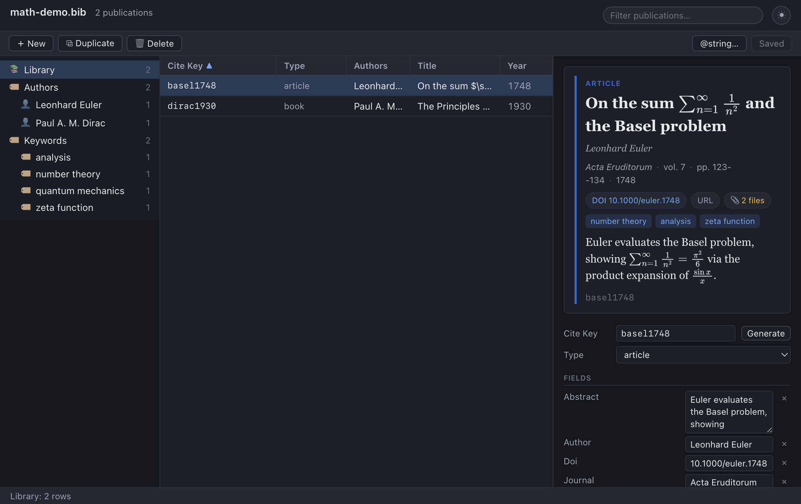

# Attachments

A bibliographic entry is rarely just metadata. The paper itself — a PDF — usually
lives somewhere on your disk, and you want it one click away from the citation.
Bibliofile lets each entry carry **any number of attachments**: the PDF of
the article, supplementary data, slides, a scanned figure, or a link to the
online version. Attachments live in the **Attachments** section near the bottom
of the detail pane, and they are stored inside your `.bib` file in a format that
is fully compatible with macOS BibDesk.

This chapter explains how to add, open, and remove attachments; how they are
stored on disk and why that matters; how the app finds the underlying files;
where BibDesk compatibility is exact and where it is not (yet); and a set of best
practices and troubleshooting tips for keeping your library and its files
together across moves and machines.



## The attachment model

An entry surfaces two distinct kinds of resource, in **two separate sections**:

| Section | Icon | What it is |
|---------|------|------------|
| **Attachments** | 📄 | Local **files** — a PDF, dataset, slide deck, image, … |
| **Links** | 🔗 | Remote web resources — derived from the entry's `Url` or `Doi`. |

They behave differently in important ways:

- **File attachments** are *managed* by the app. You add and remove them through
  the Attachments controls, and they are stored as numbered `Bdsk-File-N` entries
  in the `.bib` file (explained below). Each managed file attachment has a **×**
  remove button.
- **Links** are *synthesized* from ordinary fields. If an entry has a `Url` or
  `Doi` field, it automatically appears under **Links** as a clickable 🔗. Because
  these are really just fields, they are **not** removed from the Links list
  directly — they have no **×** there. To change one, edit or delete the
  `Url`/`Doi` field in the **Fields** section instead (see
  [Editing Entries](03-editing-entries.md#editing-fields)).

> **Links are not attachments.** A `Url` and a `Doi` are *links*, not files, so
> they don't count toward the entry's attachment count — the table paperclip and
> the preview card's "📎 N files" chip count **only local file attachments**. An
> entry with just a DOI and a URL has **no** file attachments (its Attachments
> section reads "No attachments."), and its links appear under **Links** and as
> DOI/URL chips on the preview card.

A single entry can mix both — for example a stored PDF (📄, under Attachments)
plus the publisher's DOI link (🔗, under Links). Each distinct target appears
once; duplicates are collapsed.

## Adding an attachment

1. Select the publication you want to attach files to.
2. In the **Attachments** section, click **＋ Add** (or choose
   **Publication → Add File Attachment…**).
3. In the file dialog, choose **one or more** files. You can multi-select
   (Shift-click or Cmd/Ctrl-click) to attach several at once.

Each chosen file is attached to the entry immediately as a new managed
`Bdsk-File-N` link, and the document is marked **unsaved**.

> **Tip:** You can also **drag a PDF (or any file) onto the window** to create a
> new entry with that file already attached — handy for importing a folder of
> papers in one go. See
> [Importing & exporting → Drag and drop](07-importing-and-exporting.md#73-drag-and-drop).

> **Warning:** Adding an attachment is an in-memory edit, like any other. It is
> **not written to your `.bib` file until you Save** (**Cmd+S** / **Ctrl+S**).
> The Save button will show **Save •** until you do. See
> [Editing Entries → The dirty/save model](03-editing-entries.md#the-dirtysave-model).

> **Note:** Adding an attachment records a *link* to the file where it currently
> sits — it does not copy or move the file. For the link to stay valid as your
> library travels, where the file lives relative to the `.bib` matters a great
> deal; see [How attachments are stored](#how-attachments-are-stored) and
> [Best practices](#best-practices-for-portable-attachments).

## Opening an attachment

Click an attachment in the **Attachments** list to open it:

- A **📄 file** (a PDF, image, dataset, `.csv`, …) opens in your operating
  system's **default application** for that file type — PDFs in your usual PDF
  reader, exactly as if you had double-clicked the file in your file manager.
- A **🔗 link** (under **Links**) opens the page in your default web browser. A
  bare DOI is opened via `doi.org`.

### Opening from the preview card

The preview card carries quick-open chips. A **📎 *N* files** chip opens the
entry's file attachments without scrolling down to the Attachments list:

- If the entry has **one** file attachment, clicking the chip **opens it
  immediately**.
- If it has **several**, clicking the chip drops down a short **menu** of the
  files; pick one to open it.

The DOI and URL chips on the same card open the link / DOI directly.

## Removing an attachment

Click the **×** next to a managed file attachment to detach it from the entry.

> **Note:** Removing an attachment only deletes the **link** from your library
> (the `Bdsk-File-N` entry). The file itself stays untouched on disk. If you want
> to delete the actual file, do that in your file manager.

As with all edits, the removal is in memory until you **Save**. Remember that
🔗 URL/DOI links cannot be removed here — edit the corresponding field instead
(see [The attachment model](#the-attachment-model)).

## How attachments are stored

Understanding where attachments live will save you headaches when you move your
library between folders or machines. File attachments are stored using BibDesk's
own format, so a library edited here remains fully interoperable with macOS
BibDesk.

### The `Bdsk-File-N` format

Each managed file attachment is stored as a numbered field on the entry:
`Bdsk-File-1`, `Bdsk-File-2`, and so on. The value of each is **not** a plain
path — it is a **base64-encoded binary property list** (a `bplist`), the same
container macOS BibDesk uses. Inside that plist is, among other things, the file's
**path relative to the folder that contains your `.bib` file**.

So an entry with one attached PDF looks, in the file, something like:

```bibtex
@article{einstein1905,
  author     = {Albert Einstein},
  title      = {Zur Elektrodynamik bewegter K{\"o}rper},
  journal    = {Annalen der Physik},
  year       = {1905},
  bdsk-file-1 = {YnBsaXN0MDD... (base64 binary plist) ...}
}
```

A few important points follow from this design:

- **The path is relative**, not absolute. The plist records something like
  `pdfs/einstein1905.pdf` — a location *relative to where the `.bib` file is* —
  rather than `/Users/you/Documents/.../einstein1905.pdf`.
- **`Bdsk-File-N` fields are hidden from the Fields list.** You will not see them
  as editable rows in the **Fields** section; they appear only as attachments.
  This keeps the editor focused on bibliographic data and prevents accidental
  corruption of the encoded blob.
- **Numbering is automatic.** When you add a file, the app assigns the next free
  index (one past the current maximum), so attachment numbers never collide even
  after removals.

### Why relative paths?

Relative paths make your library **portable**. Because each attachment is
recorded relative to the `.bib` file, the *whole bundle* — library plus its
files — can be moved, copied, zipped, or synced to another computer, and every
link still resolves, as long as the files keep the same position relative to the
`.bib`. An absolute path, by contrast, would break the instant the library left
the one machine and user account it was created on.

### Remote links (`Url` / `Doi`)

As noted above, an entry's `Url` and `Doi` fields are surfaced under a separate
**Links** section as 🔗 links (and as DOI/URL chips on the preview card). These
are stored as ordinary BibTeX fields (not `Bdsk-File-N` blobs), shown verbatim
(URLs are never TeX-transformed), edited like any other field, and — being links
rather than files — are **not** counted as attachments.

## How attachments resolve

When the app displays and opens a file attachment, it must turn the stored
relative path into a concrete file on your disk. It does so as follows:

1. It reads the relative path out of the `Bdsk-File-N` plist (for example,
   `pdfs/einstein1905.pdf`).
2. It takes the **directory that contains your `.bib` file** as the base — call
   it the *library folder*.
3. It joins the two: *library folder* + *relative path* → an absolute path
   (`/path/to/library/pdfs/einstein1905.pdf`).
4. Clicking the attachment hands that absolute path to the operating system to
   open.

If a stored path is already absolute (some files created elsewhere may be), it is
used as-is. The display name shown for each file is just its last path segment
(its filename); for links it is the URL's final segment or host.

> **Tip:** The practical upshot of resolution is simple — **keep your files in a
> predictable place relative to the `.bib`**, and they will always open. Move the
> `.bib` and its files together and nothing breaks; move them apart and the
> relative paths no longer point anywhere.

## Finding and repairing broken links

When files move, get renamed, or arrive from a library assembled on another
machine, some attachments stop resolving. To find them all at once, choose
**Publication → Find Broken Links…**. It scans **every** entry and lists each
attachment whose file is missing on disk, showing the entry's cite key, the
attachment's name, and the full path it expected to find.

For each broken **managed** attachment (a `Bdsk-File-N` link — see
[below](#the-bdsk-file-n-format)) you get two repair actions:

- **Locate…** — opens a file picker; choose the file's new location and the link
  is rewritten (stored relative to the `.bib`, as always). The entry is **not**
  marked broken any more, and the list re-scans so you can see your progress.
- **Remove** — drops the attachment from the entry (the file itself is never
  touched; this only removes the dangling link).

Clicking a row's **cite key** selects that entry in the main list (and closes the
dialog) so you can inspect or edit it directly. Links that come from a plain
field (a `Local-Url`, say, rather than a managed `Bdsk-File-N` blob) are listed
for awareness but are fixed by editing that field on the entry.

> **Tip:** If files merely *moved together* into a new folder, it is usually
> faster to fix them in bulk with [AutoFile](#autofile-organising-linked-files)
> (which re-files into your Papers folder) than to Locate each one by hand —
> though AutoFile needs the originals to still exist, so genuinely missing files
> must be re-located or removed here.

## Compatibility with macOS BibDesk

Bibliofile is designed to share libraries seamlessly with the original
macOS BibDesk. There are two things to know about attachment compatibility.

### macOS bookmarks are preserved

In addition to a relative path, a `Bdsk-File-N` blob created by macOS BibDesk
contains an Apple **file bookmark** (alias) — macOS's mechanism for tracking a
file even after it is renamed or moved within a volume.

This app **preserves those bookmarks untouched** when it saves. It re-emits the
existing blob byte-for-byte, so a library you round-trip through Bibliofile
stays fully valid for macOS BibDesk: the bookmarks BibDesk relies on are still
there, intact.

### Moved-file resolution by bookmark is not (yet) implemented here

The flip side of the previous point: while this app *preserves* macOS bookmarks,
it does **not yet use** them to *find* a moved file. macOS BibDesk can follow a
bookmark to locate a PDF you renamed or moved elsewhere; Bibliofile, being
cross-platform, currently resolves attachments **by their relative path only**
(as described in [How attachments resolve](#how-attachments-resolve)).

The honest consequence:

- If you move or rename a file but keep its **relative path correct** (e.g. you
  move both the `.bib` and its `pdfs/` folder together), the link works fine.
- If you move a file **independently** of the library so that its relative path
  no longer points to it, this app will not silently re-find it by bookmark the
  way macOS BibDesk might. **Fix it by restoring the relative layout, or re-add
  the file from its new location** (and remove the stale link).

> **Note:** This is a difference in *resolution behavior only* — your file is not
> harmed and the bookmark is not discarded. Open the same library in macOS
> BibDesk and its bookmark-following still works; the bookmark survives the
> round-trip through this app.

## Best practices for portable attachments

Because attachments resolve by relative path, a little organization keeps every
link healthy forever:

1. **Keep attachments beside the library.** Put your `.bib` file and your PDFs in
   the same directory tree. The most common arrangement is a subfolder next to
   the library:

   ```
   MyLibrary/
   ├── library.bib
   └── pdfs/
       ├── einstein1905.pdf
       ├── ng2024types.pdf
       └── ...
   ```

2. **Move the whole folder, not just the file.** When you copy or sync the
   library to another machine, move the entire `MyLibrary/` folder so the
   `.bib` and `pdfs/` keep their relative positions. Every link resolves on the
   new machine without any path fixing.

3. **Avoid absolute paths and scattered files.** If files live all over your disk
   and get recorded with absolute paths, the links break the moment the library
   moves. Consolidate them into the library folder instead.

4. **Use version control or a synced folder for the bundle.** Because the `.bib`
   is plain text and the PDFs are ordinary files, the whole `MyLibrary/` folder
   drops cleanly into Git, Dropbox, iCloud Drive, or similar — and the relative
   links travel intact.

> **Tip:** A single tidy library folder per project — `.bib` plus a `pdfs/`
> subfolder — is the layout that "just works" everywhere and is also the easiest
> to back up and share.

## AutoFile: organising linked files

Keeping attachments tidy by hand — naming each PDF consistently and filing it in
the right place — is tedious. **AutoFile** does it for you: it moves an entry's
attached files into a single **Papers folder** and renames them by a format you
choose, then updates the `Bdsk-File-N` links to point at their new homes. It is
the same idea as BibDesk's AutoFile.

### Setting it up

Before AutoFile can run, tell it where your Papers folder is and how to name
files, in **Preferences**:

- **AutoFile → Papers folder** — click **Choose…** and pick the folder where
  filed attachments should live (the **×** clears it). AutoFile is **disabled
  until this is set**.
- **AutoFile → File name** — the file-name format. The default is `%a1/%Y%u0`,
  which files each paper in a *first-author* subfolder and names it by *year*,
  adding a short disambiguator only when two papers would otherwise collide.

The file-name format uses the same mini-language as the cite-key format (see
[Editing entries → How Generate works](03-editing-entries.md#how-generate-works)).
Useful specifiers include `%a1` (first author's surname), `%A` (authors with
initials), `%Y` / `%y` (4- or 2-digit year), `%t` / `%T` (title characters /
words), `%f{Field}` (any field's value), a literal `/` to create a subfolder, and
`%u` / `%U` / `%n` (a lowercase / uppercase / numeric disambiguator added only
when needed to avoid a name clash). The file's original extension is kept
automatically.

### Running it

Select an entry and choose **Publication → AutoFile Linked Files**. For that
entry, each managed file attachment is:

1. **Moved** into the Papers folder, into the subfolder and under the name the
   format produces (e.g. `Einstein/1905.pdf`). If a file with that name already
   exists, a disambiguator keeps it unique.
2. **Re-linked** — the `Bdsk-File-N` link is rewritten to the file's new location
   (still as a path relative to your `.bib`, so the library stays portable).

AutoFile works on the **selected entry** only, so you can file papers as you add
them. As with any edit, the change is in memory until you **Save**.

> **Note:** AutoFile **moves** the actual file on disk (copying then deleting if
> the destination is on a different drive). The original file leaves its old
> location. This is the point — it consolidates scattered downloads into one
> well-named library — but be aware it is a real file move, not a copy.

> **Tip:** AutoFile pairs naturally with
> [drag-and-drop import](07-importing-and-exporting.md#73-drag-and-drop): drop a
> pile of PDFs to create entries with the files attached where they sit, fill in
> the author and year, then run AutoFile to move and rename each one into your
> Papers folder.

## Attachments and full-text PDF search

The app indexes the **text inside your attached PDFs**, so the search box finds
papers by their actual contents, not just their bibliographic fields. This relies
on exactly the attachment links described in this chapter: the search index can
only read a PDF that the app can resolve and open, so keeping your files reliably
reachable (the [best practices](#best-practices-for-portable-attachments) above,
or [AutoFile](#autofile-organising-linked-files)) is what lets full-text search
reach into them. PDF text is extracted in the background shortly after a library
opens, so PDF matches may appear a moment after the first results. See
[Browsing & Searching](02-browsing-and-searching.md) for how the search behaves.

## Quick reference

| Action | How |
|--------|-----|
| Add file attachment(s) | Select entry → **＋ Add** in Attachments (or **Publication → Add File Attachment…**) → pick one or more files |
| Add via drag-and-drop | Drag a PDF/file onto the window → new entry with the file attached |
| Open an attachment | Click it → opens in your OS default app (PDFs in your usual reader); or click the **📎 N files** preview chip |
| Open another file / link | Click it (file → default app; link → browser) |
| Remove a file attachment | Click **×** beside it |
| Remove a URL/DOI link | Edit/delete the `Url` or `Doi` field in **Fields** |
| File attachments into the Papers folder | **Publication → AutoFile Linked Files** (set the Papers folder + format in Preferences) |
| Reveal the `.bib` in your file manager | **File → Show in Finder** (macOS) / **Show in File Manager** |
| Persist attachment changes | **Save** (Cmd+S / Ctrl+S) — attachments are in memory until saved |

## Troubleshooting

**"An attachment won't open."**
The file has almost certainly **moved, been renamed, or been deleted**, so its
stored relative path no longer points to it. Check that the file still exists at
*library-folder* + *relative-path*. If you moved it, either restore the original
layout, or remove the stale link (**×**) and re-add the file from its new
location. Remember this app resolves by relative path, not by macOS bookmark, so
a file moved out from under the library is not auto-relocated here.

**"My links broke after I moved the library to another machine."**
You probably moved the `.bib` without its files, or changed the relative layout.
Move the entire library folder (the `.bib` *and* the `pdfs/` subfolder, keeping
their relative positions) together. See
[Best practices](#best-practices-for-portable-attachments).

**"I added a file but it's gone after restarting."**
Adding an attachment is an unsaved edit. If you closed the app without saving,
the change was discarded. Add it again and press **Save** (Cmd+S / Ctrl+S);
the button reads **Save •** while there are unsaved changes.

**"There's no × to remove this link."**
It is a 🔗 URL/DOI link synthesized from a field, not a managed file. Remove or
edit the `Url`/`Doi` field in the **Fields** section instead.

**"My DOI/URL link goes to the wrong place."**
The link is taken verbatim from the entry's `Doi`/`Url` field. Correct the field
value in the **Fields** section.

**"AutoFile says no Papers folder is configured."**
AutoFile needs a destination folder before it can run. Open **Preferences →
AutoFile** and choose a **Papers folder** (and, if you like, adjust the **File
name** format). Then select an entry and run **Publication → AutoFile Linked
Files** again.

**"An attachment won't open / nothing happens."**
Opening hands the file to your OS through its attachment link, so the same things
that break a link break opening: the file has moved, been renamed, or been
deleted relative to the `.bib`. Restore the layout or re-add the file (or use
**Find Broken Links** to locate it).

**Cross-machine sync tips.**
Sync the *whole library folder* (e.g. via Git, Dropbox, or iCloud Drive) rather
than the `.bib` alone. The plain-text `.bib` plus a `pdfs/` subfolder with
relative links is sync-friendly and conflict-resistant. If you also use macOS
BibDesk on one of the machines, rest assured the file bookmarks it relies on are
preserved by this app, so the library stays usable from both.

## See also

- [Editing Entries](03-editing-entries.md)
- [Getting Started](01-getting-started.md)
- [Browsing & Searching](02-browsing-and-searching.md)
- [Importing & Exporting](07-importing-and-exporting.md) — dropping a PDF to
  create an entry with the file attached.
- [Online Search](08-online-search.md)
- [Shortcuts & Reference](09-shortcuts-and-reference.md)
