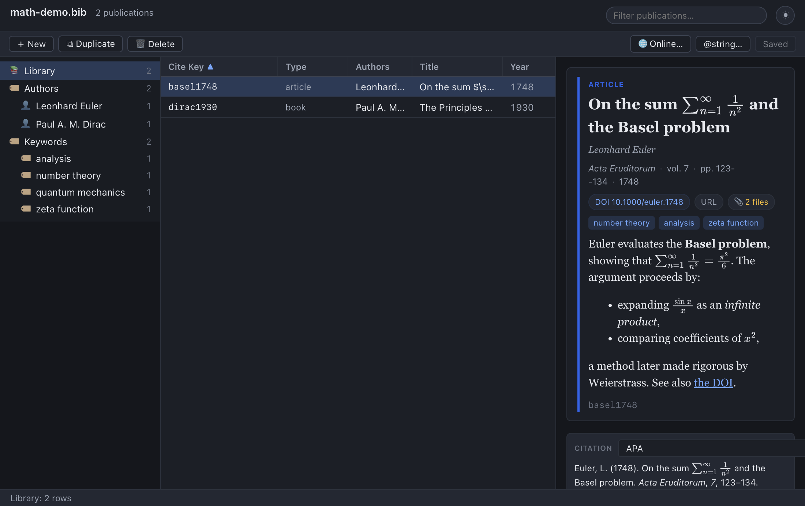
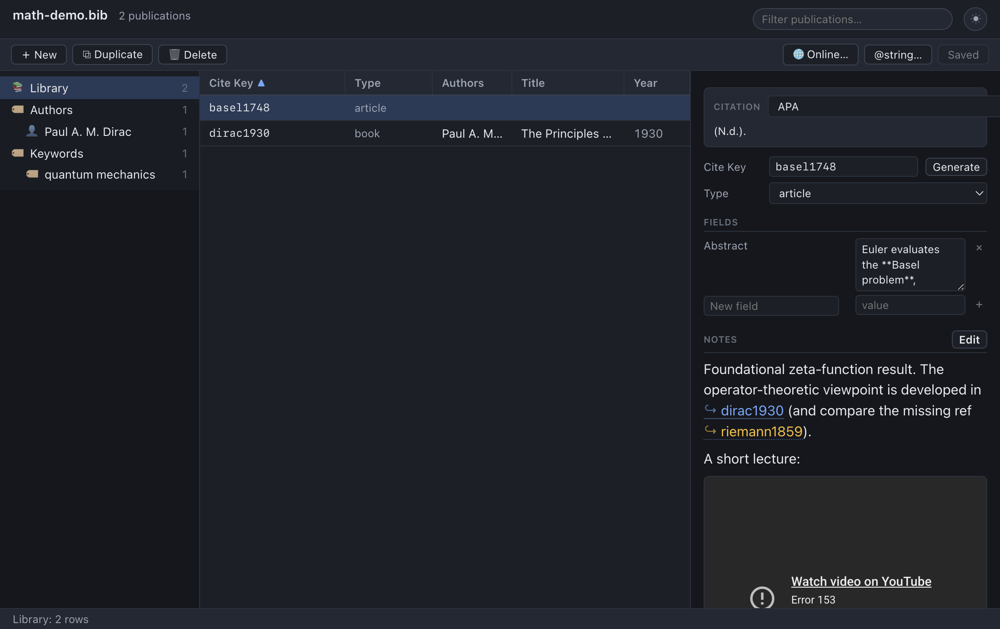

# Notes & Abstracts

Every reference in your library can carry two kinds of free-form prose: an
**Abstract** and a set of **Notes**. In bibdesk-electron both are written in
**Markdown** — a handful of plain-text conventions that the app renders into
clean, typeset prose in the detail pane. Both can contain **mathematics**, which
is typeset with MathJax; Notes can additionally hold **cross-references** to
other entries in your library and **inline embeds** (such as a video player).

Crucially, neither feature changes what lands in your `.bib` file. Markdown is
just text, so an abstract or a note remains an ordinary BibTeX field value: it
stays portable, diff-friendly, and perfectly legible to classic BibDesk, to
`bibtex`/`biber`, and to anyone reading the file in a plain editor. The
formatting is applied only when the app *displays* the value; nothing is written
back into the file beyond the characters you typed.

This chapter explains the two fields in depth, gives a complete reference to the
Markdown the app accepts, documents the maths, cross-reference, and embed
features with worked examples, and finishes with edge cases and troubleshooting.

> **Tip:** If you only remember one thing, remember this — *Abstract* is the
> field shown in the preview card at the top of the detail pane; *Notes* is the
> editable section lower down, stored in the `Annote` field. Notes can do
> everything Abstracts can, plus cross-references and embeds.

## Two fields, two purposes

bibdesk-electron deliberately keeps the two prose fields distinct, because they
play different roles in a reference library.

### The Abstract field

The **Abstract** is the summary of the work itself — typically the author's own
abstract, pasted in from a paper or a database record. It belongs *to the
reference*. The app reads it from the standard BibTeX `Abstract` field and
renders it as Markdown inside the **preview card** at the top of the detail
pane, immediately below the venue line, chips, and keyword tags. See
[Preview & Citations](06-preview-and-citations.md) for the full anatomy of the
card.

Because the Abstract is part of the citation record, it is also handed to the
citation processor: when a CSL style asks for an abstract (some annotated
bibliography styles do), the rendered text comes from this same field.

The Abstract uses the **strict** Markdown profile (see
[The sanitizer](#the-sanitizer-what-survives-rendering) below). It supports
headings, emphasis, lists, links, code, blockquotes, and maths — but it does
*not* allow embedded `<iframe>` players or `[[citeKey]]` cross-references. Those
are reserved for Notes.

### The Notes field

**Notes** are *your* commentary — what you thought about the paper, how it
connects to your own work, the page where the key result lives, a reminder to
follow up a reference. Notes are stored in the BibTeX `Annote` field (BibDesk's
long-standing convention for annotations) and are edited through the dedicated
**Notes** section near the bottom of the detail pane, using an **Edit / Done**
toggle.

Notes use the **richer** Markdown profile. On top of everything the Abstract
supports, Notes additionally allow:

- **Cross-references** written `[[citeKey]]`, which become clickable links that
  select the referenced entry — the foundation of a linked knowledge base.
- **Inline embeds** via an `<iframe>` (restricted to `http`/`https`), so you can
  drop in a video, a slide deck, or an interactive widget.

### Comparison at a glance

| Aspect | Abstract | Notes |
| --- | --- | --- |
| Stored in BibTeX field | `Abstract` | `Annote` |
| Where it appears | Preview card (top of detail pane) | Notes section (lower in detail pane) |
| How you edit it | As a normal field in the **Fields** list | Dedicated **Edit / Done** editor |
| Markdown | Yes (strict profile) | Yes (richer profile) |
| Maths (`$…$`, `$$…$$`) | Yes | Yes |
| Links (`[text](url)`) | Yes (open externally) | Yes (open externally) |
| `[[citeKey]]` cross-refs | No | Yes |
| Inline `<iframe>` embeds | No | Yes (`http`/`https` only) |
| Fed to CSL citation engine | Yes (as `abstract`) | No |

## Writing an Abstract

The Abstract is edited like any other field. Select an entry, find **Abstract**
in the **Fields** list, and type or paste Markdown into its box. (Because
abstracts tend to be long, the editor gives the Abstract field a multi-line text
area automatically.) The moment you commit the edit — by clicking away or
pressing **Enter** to leave the box — the preview card at the top re-renders with
the formatted result.

> **Procedure — set an abstract**
>
> 1. Select the entry in the publications table.
> 2. In the **Fields** list, locate the **Abstract** row. If the entry has no
>    abstract yet, add one with the **New field** row at the bottom of the list
>    (type `Abstract`, then the text).
> 3. Type or paste Markdown into the value box.
> 4. Click elsewhere (or press **Enter**) to commit.
> 5. Watch the preview card at the top of the pane re-render with your
>    formatting.

### A worked example

Typing this into the Abstract field:

```markdown
We show that **gravity** bends light, with deflection

$$\theta = \frac{4GM}{c^2 b}.$$

See the *original* result in the [1919 eclipse data](https://example.org).
```

…renders in the preview card as a paragraph with a bold "gravity", a centred
display equation, a second paragraph beginning with an italic "original", and a
clickable "1919 eclipse data" link that opens in your browser.



## Writing Notes

Notes live in their own section toward the bottom of the detail pane. Unlike the
Abstract — which you edit inline as a field — Notes have an explicit editing
mode so the rendered view (with its clickable cross-references and embeds) does
not get in the way of typing.

> **Procedure — write notes**
>
> 1. Select the entry.
> 2. Scroll to the **Notes** section. If the entry has no notes yet, you'll see
>    *"No notes. Click Edit to add markdown notes."*
> 3. Click **Edit**. The section becomes a Markdown text area.
> 4. Type your notes — Markdown, maths, `[[citeKey]]` links, and `<iframe>`
>    embeds are all allowed.
> 5. Click **Done** to leave editing mode and see the rendered result.

The editor commits whenever it loses focus, so clicking **Done** (or clicking
anywhere outside the text area) saves your text into the `Annote` field. The
placeholder text in an empty editor reminds you of the extras:
*"Markdown notes. Link entries with `[[citeKey]]`. Inline `<iframe>` embeds
allowed."*



> **Note:** Editing notes marks the document as having unsaved changes, exactly
> like editing any other field. Your text is held in memory until you **Save**
> (Cmd+S / Ctrl+S), at which point it is written to the `Annote` field in the
> `.bib` file. See [Editing Entries](03-editing-entries.md).

## Markdown reference

bibdesk-electron renders Markdown with a standard CommonMark-style parser and
then runs the result through a **sanitizer** that keeps only a known-safe set of
HTML tags. This section documents everything the renderer supports; the
[sanitizer](#the-sanitizer-what-survives-rendering) section below explains what
is allowed through and what is stripped.

Everything here works in **both** Abstracts and Notes unless noted otherwise.

### Headings

Begin a line with one to six `#` characters and a space:

```markdown
# Top-level heading
## Section
### Subsection
```

These render as `<h1>`…`<h6>` elements. In practice abstracts and notes are
short, so you will rarely need more than `##` or `###`, but the full range is
available.

### Emphasis

| You type | You get |
| --- | --- |
| `*italic*` or `_italic_` | *italic* |
| `**bold**` or `__bold__` | **bold** |
| `***bold italic***` | ***bold italic*** |
| `~~struck through~~` | ~~struck through~~ |
| `` `inline code` `` | `inline code` |

Emphasis renders as `<em>`/`<i>`, `<strong>`/`<b>`, and `<del>` (strikethrough)
respectively; inline code becomes `<code>`.

> **Warning:** Underscores and asterisks are *also* meaningful inside TeX maths
> (think `x_1` or `a^*`). The app protects maths spans before parsing Markdown
> precisely so a subscript underscore is **not** mistaken for italics — see
> [How maths is protected](#how-maths-is-protected-and-typeset). The protection
> only works for properly delimited maths, so always wrap maths in `$…$`.

### Lists

**Unordered** lists use `-`, `*`, or `+`:

```markdown
- First point
- Second point
  - A nested point (indent by two spaces)
- Third point
```

**Ordered** lists use a number followed by `.`:

```markdown
1. Set up the experiment
2. Collect the data
3. Analyse the results
```

These render as `<ul>`/`<ol>` with `<li>` items, with nesting preserved by
indentation.

### Links

Write `[link text](https://example.org)`:

```markdown
The dataset is published at [Zenodo](https://doi.org/10.5281/zenodo.123456).
```

> **How links work:** For safety, the app does **not** let a rendered link
> navigate the window. Instead the link's destination is attached to the element,
> and when you click it the app opens the URL in your **external** browser via
> the operating system. This is why every link in an abstract or note opens
> outside the app rather than replacing the view. (Plain `[[citeKey]]`
> cross-references are the exception — those navigate *within* the library; see
> below.)

### Code

Inline code uses backticks (above). **Fenced** code blocks use three backticks:

````markdown
```
@article{key,
  title = {A title},
  year  = {2020},
}
```
````

…which renders as a `<pre><code>` block. A language hint after the opening fence
(for example ```` ```python ````) is accepted by the parser; the rendered output
is a monospaced block either way.

### Blockquotes

Prefix lines with `>`:

```markdown
> The result holds only under the stated assumptions.
> The authors flag this explicitly in §4.
```

…which renders as an indented `<blockquote>`.

### Horizontal rules

Three or more hyphens on their own line (`---`) render as a horizontal rule
(`<hr>`).

### Superscripts and subscripts

The sanitizer allows `<sup>` and `<sub>` if your Markdown produces them, which
is occasionally handy for chemistry or ordinals (`1<sup>st</sup>`). For
mathematical sub/superscripts, prefer real maths (`$x_1$`, `$x^2$`) so they
typeset correctly — see [Mathematics](#mathematics).

### The sanitizer: what survives rendering

After Markdown is parsed to HTML, the app **sanitizes** it: any tag not on the
allow-list is removed, and dangerous content (script, event handlers, inline
styles, unknown attributes) is stripped. This is a security boundary — your
`.bib` files might come from colleagues or the web, and rendered prose must never
be able to run code.

The **Abstract (strict) profile** permits these tags:

> `p`, `br`, `em`, `strong`, `b`, `i`, `code`, `pre`, `ul`, `ol`, `li`,
> `blockquote`, `h1`–`h6`, `a`, `sup`, `sub`, `hr`, `del`, `span`

The **Notes profile** permits everything above **plus `iframe`** (see
[Inline embeds](#inline-embeds-notes-only)).

Anything else is dropped. In particular:

- `<script>` tags and any JavaScript are removed entirely.
- Event-handler attributes (`onclick`, `onload`, …) are removed.
- Inline `style` attributes and arbitrary classes are not preserved.
- Images (``) are not in the allow-list, so raw image tags are stripped.
- In **Abstracts**, an `<iframe>` is stripped (it is a Notes-only capability).

> **Note:** This means you cannot "break out" of the formatting by pasting raw
> HTML — only the documented Markdown and (in Notes) `http`/`https` iframes get
> through. That is by design.

## Mathematics

Both Abstracts and Notes can contain TeX-style mathematics, typeset by
**MathJax** (the same engine used across the preview). MathJax is bundled with
the app and runs **fully offline** — there is no call to a CDN, so maths renders
even with no network connection.

### Inline and display maths

| Syntax | Meaning | Example | Renders as |
| --- | --- | --- | --- |
| `$ … $` | Inline maths (in the flow of text) | `the mass $m$ and energy $E$` | the mass *m* and energy *E* |
| `$$ … $$` | Display maths (centred, on its own line) | `$$E = mc^2$$` | a centred equation |
| `\( … \)` | Inline maths (alternative delimiter) | `\(\alpha + \beta\)` | inline α + β |
| `\[ … \]` | Display maths (alternative delimiter) | `\[\int_0^1 x\,dx\]` | a centred integral |

A few concrete examples:

```markdown
The first eigenvalue is $\lambda_1$, and we index the sequence by $x_1, x_2, \dots$.

The harmonic mean of $a$ and $b$ is

$$H = \frac{2}{\tfrac{1}{a} + \tfrac{1}{b}} = \frac{2ab}{a+b}.$$
```

This renders with inline "λ₁" and "x₁, x₂, …" sitting in the running text, then a
centred display equation for the harmonic mean. Notice that `$x_1$` produces a
proper subscript — the underscore is *not* turned into Markdown emphasis (see
the next subsection for why), and `$\frac{a}{b}$` keeps its braces, so the
fraction lays out correctly.

> **Tip:** `processEscapes` is enabled, so to write a literal dollar sign in
> prose, escape it as `\$`. For example, `a \$5 fee` shows a literal `$5` and is
> not mistaken for the start of a maths span.

### How maths is protected and typeset

Understanding the rendering pipeline explains why some things work and others
don't:

1. **Protect maths.** Before any Markdown is parsed, the app finds every maths
   span — `$$…$$` first, then `$…$` — and replaces each with a placeholder. This
   is what stops Markdown from "seeing" the `_`, `*`, `{`, or `}` characters
   inside maths and misinterpreting them as emphasis or stray markup.
2. **Render Markdown.** The placeholder-protected text is parsed to HTML and
   sanitized.
3. **Restore maths.** The placeholders are swapped back for the original maths
   text, verbatim.
4. **Typeset.** When the rendered card or note is shown, the app runs MathJax
   over it, turning the `$…$`/`$$…$$` spans into crisp SVG equations that inherit
   the surrounding text colour (so maths looks right in both light and dark
   themes).

Two consequences worth knowing:

- **Inline maths must stay on one line.** The pattern that recognises inline
  `$…$` does not allow a newline inside it (display `$$…$$` may span lines). If
  you split an inline expression across two lines, the dollar signs won't pair
  up and the maths won't be protected. Keep each inline expression on a single
  line, or use a display block.
- **Braces inside maths are preserved.** Elsewhere the app strips BibTeX
  case-protection braces for display (so `{C}alabi-{Y}au` shows as
  *Calabi-Yau*), but it is **maths-aware**: braces inside a `$…$`/`$$…$$` span
  are left untouched, so `$\frac{a}{b}$` and `$\sqrt{x}$` survive intact.

> **Note:** MathJax typesetting is best-effort. In the unlikely event the engine
> fails to load, the raw TeX text (e.g. `$E = mc^2$`) is simply left in place
> rather than crashing the view — readable, just not typeset.

## Cross-references *(Notes only)*

Notes can link to **other entries in the same library** using a wiki-style
double-bracket syntax. Write a cite key inside `[[ … ]]`:

```markdown
This extends the argument in [[einstein1905]] and corrects [[smith2010]].
It should be read alongside [[bohr1913]].
```

Each `[[citeKey]]` becomes a clickable link (prefixed with a small ↪ marker).
**Clicking it selects that entry** — the publications table jumps to the
referenced item and its detail pane opens, just as if you'd clicked the row
yourself. This turns your notes into a navigable web of connections: a
literature trail, a "cited by / builds on" graph, or a running argument that
threads through many papers.

### Matching and missing keys

- Cite-key matching is **case-insensitive**, so `[[Einstein1905]]` finds
  `einstein1905`.
- If two entries somehow share a cite key, the link resolves to the **first**
  match (matching BibDesk's own behaviour).
- If a cite key matches **no** entry in the library, the link is rendered in a
  distinct **warning style** — coloured differently and with a dotted underline —
  so you can spot typos or not-yet-added references at a glance. The link is
  still shown; it simply has nowhere to go until the entry exists.

> **Tip:** The missing-key styling makes cross-references a lightweight
> "to-import" list. Jot `[[chen2024]]` in a note while reading; it shows as
> missing until you add Chen 2024 to the library, at which point the same link
> lights up and starts working — no need to edit the note again.

> **Note:** `[[citeKey]]` cross-references are recognised in **Notes only**.
> They are not interpreted in the Abstract, where the text would simply show the
> literal brackets.

## Inline embeds *(Notes only)*

Notes may contain a single inlined `<iframe>` (or several) to embed external
content — a conference talk, a slide deck, an interactive demo — right inside the
note. Paste the iframe markup directly into the note text:

```markdown
Here's the talk that inspired this line of work:

<iframe src="https://www.youtube.com/embed/dQw4w9WgXcQ"
        width="480" height="270"
        title="Conference talk"
        allowfullscreen></iframe>
```

When the note is rendered, the iframe appears in place, framed to match the
theme, and capped to the width of the pane.

### What is allowed

The sanitizer is strict about iframes:

- **Scheme.** Only `http` and `https` sources are permitted. A `src` using any
  other scheme (`file:`, `javascript:`, `data:`, a relative path, …) is rejected
  and the iframe is dropped.
- **Attributes.** A fixed set of presentation/behaviour attributes is allowed:
  `src`, `width`, `height`, `frameborder`, `allow`, `allowfullscreen`,
  `loading`, `title`, and `sandbox`. Anything else is stripped.
- **No scripts.** As everywhere, `<script>` tags and event handlers are removed.
  An iframe loads its own page in an isolated frame; the surrounding note never
  runs the embedded site's code directly.

> **Warning — a security note:** An embedded iframe loads a *live external page*
> over the network. Only embed sources you trust, and prefer providers' official
> "embed" URLs (for example, a site's `…/embed/…` player URL) over arbitrary
> pages. Embeds are a capability you opt into by pasting an iframe; the strict
> scheme and attribute filtering exists to keep that opt-in as safe as possible,
> but it cannot vouch for the content of a third-party site. Embeds are a
> Notes-only feature for this reason — Abstracts keep the simpler, stricter
> profile with no embedding at all.

## Plain text under the hood

Both fields are stored as **plain text** in your `.bib` file:

```bibtex
@article{einstein1916,
  author   = {Einstein, A.},
  title    = {Die Grundlage der allgemeinen Relativit{\"a}tstheorie},
  journal  = {Annalen der Physik},
  year     = {1916},
  Abstract = {We derive the field equations from the equivalence principle.

$$G_{\mu\nu} = 8\pi T_{\mu\nu}.$$},
  Annote   = {Builds on [[einstein1905]]; see the lecture
<iframe src="https://example.org/embed/lecture"></iframe>},
}
```

The Markdown, the maths, the `[[citeKey]]` references, and the iframe text all
sit in the file as ordinary characters. The app renders them when it displays
the entry, but it adds nothing to the file beyond what you typed. This is what
keeps your library **portable**: it round-trips cleanly through classic BibDesk
and the wider TeX/LaTeX ecosystem, and the same text is perfectly readable in a
plain editor. (Naturally, *other* tools won't render the Markdown — they'll show
the raw text — but nothing is lost or mangled.)

## Edge cases and troubleshooting

### Maths isn't rendering (I see raw `$…$`)

- **Check your dollar-sign pairing.** Every `$` must be matched. An odd number
  of `$` on a line leaves the maths span open and it won't be recognised.
- **Keep inline maths on one line.** Inline `$…$` may not contain a newline.
  Split expressions either belong on one line or in a `$$…$$` display block
  (which *may* span lines).
- **Escape literal dollars.** If you meant a real `$` (a price, say), write `\$`
  so it isn't read as the start of a maths span.
- If maths is genuinely failing to typeset (raw TeX everywhere), MathJax may
  have failed to initialise; the app degrades to showing the source text rather
  than erroring.

### A cross-reference shows in the warning (missing) style

The cite key in `[[…]]` doesn't match any entry in the **current** library.
Check for:

- a **typo** in the key (`[[smith2010]]` vs `[[smtih2010]]`);
- the entry not yet being **imported** (the link will start working once you add
  it);
- the link being in an **Abstract** rather than Notes — `[[citeKey]]` is only
  interpreted in Notes.

Matching is case-insensitive, so capitalisation alone is never the problem.

### An iframe didn't appear

- It is in an **Abstract**, not Notes — iframes are Notes-only.
- Its `src` is not `http`/`https` (relative paths and `file:`/`data:`/
  `javascript:` URLs are rejected).
- The provider blocks embedding (some sites refuse to be framed); that's a
  decision made by the remote site, not the app.

### Emphasis appeared where I didn't want it

A stray `*` or `_` in prose can trigger italics. Escape it with a backslash
(`\*`, `\_`) to show it literally. Inside properly delimited maths, these
characters are protected automatically and need no escaping.

### My formatting doesn't show in another tool

Other BibTeX tools don't render Markdown — they show the raw `Abstract`/`Annote`
text. That's expected and harmless: the field content is unchanged, just
unformatted elsewhere.

## See also

- [Preview & Citations](06-preview-and-citations.md) — where the rendered
  abstract appears, and how formatted citations work.
- [Editing Entries](03-editing-entries.md) — editing fields, the `Annote` field,
  and saving.
- [Browsing & Searching](02-browsing-and-searching.md) — finding the entries you
  cross-reference.
