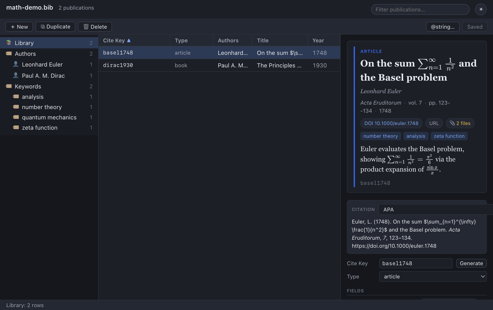

# Preview & Citations

One of the headline goals of Bibliofile — and a deliberate step up from
classic BibDesk — is a **rich, themed presentation** of your references. When you
select an entry, the right-hand detail pane opens with two reading-oriented
views stacked above the editor:

1. A **preview card** — a typeset, magazine-style summary of the entry, with a
   colour-coded entry type, the title and authors, the venue line, clickable
   chips for links and attachments, keyword tags, the rendered abstract, and the
   cite key.
2. A **formatted citation** — the same entry rendered in a real citation style
   (APA, Vancouver, or Harvard), generated by a genuine CSL engine and updated
   live as you edit.

Both views adapt to the **light or dark theme**, and both can contain typeset
mathematics. This chapter walks through every element of each view, explains how
they are produced, and notes the current limitations honestly.

> **Tip:** The preview card and the formatted citation are *views*, not editors.
> To change what they show, edit the entry's fields below them (see
> [Editing Entries](03-editing-entries.md)); the views refresh automatically.

> **Note:** The formatted citation here is a **CSL** rendering (APA / Vancouver /
> Harvard) — convenient and copy-ready, but independent of LaTeX's `.bst` system.
> If you want to see exactly what `bibtex` will produce for the `.bst` style you
> cite with, open the **LaTeX Preview** in the bottom panel: it typesets the
> selected entries' bibliography with your local TeX install and chosen `.bst`.
> See [Configurable Panels → LaTeX preview](10-panels.md#latex-preview).

## The preview card

At the top of the detail pane sits the **preview card**: a clean, typographic
summary of the selected entry, set in a serif face to read like a printed
reference rather than a form.

The card appears only when the entry has enough to show — at minimum a title,
author, venue, or year. A completely empty entry shows no card (the editor below
still works as normal).

### Anatomy of the card

The card is composed, top to bottom, of the following elements. Each is present
only when the entry has the corresponding data.

| Element | Source field(s) | Notes |
| --- | --- | --- |
| Entry-type label + colour accent | the entry's BibTeX type | Small uppercase label (e.g. `ARTICLE`); a coloured left border keyed to the type |
| Title | `Title` | Rendered with maths; protective braces stripped for display |
| Authors | `Author` (falls back to `Editor`) | Italic; joined with commas and a final "and"; "et al." when the field ends in `and others` |
| Venue line | `Journal` (or `Booktitle`), `Volume`, `Pages`, `Year` | Dot-separated; journal/booktitle in italics |
| Chips | `Doi`, `Url`, attachment count | Clickable pills (see below) |
| Keyword tags | `Keywords` | One small pill per keyword (split on `,`/`;`) |
| Abstract | `Abstract` | Rendered as Markdown + maths |
| Cite key | the entry's cite key | Monospaced, muted, at the foot of the card |

#### Entry-type accent

The card carries a coloured **left border** and a small uppercase **type label**
(for example `ARTICLE` or `BOOK`) so you can tell at a glance what kind of
reference you're looking at. The colour is chosen from the entry type:

| Entry type(s) | Accent colour |
| --- | --- |
| `article` | Blue |
| `book` | Violet |
| `incollection`, `inbook` | Purple |
| `inproceedings`, `conference`, `proceedings` | Cyan |
| `phdthesis`, `mastersthesis` | Green |
| `techreport` | Amber |
| `misc`, `unpublished` | Grey |
| any other type | The app's default accent (blue) |

> **Note:** The label text always reflects the entry's *actual* type (so an
> unusual type such as `dataset` shows `DATASET`); only the colour falls back to
> the default accent when the type isn't in the table above.

#### Title and authors

The **title** is shown in a large serif weight. It is de-TeXified for display —
control sequences such as `{\"a}` become `ä`, and BibTeX case-protection braces
are removed (`{C}alabi-{Y}au` shows as *Calabi-Yau*) — while any `$…$`/`$$…$$`
maths is preserved and typeset, so a title like *On $SU(2)$ gauge fields* renders
with proper maths.

The **author line** is set in italics. Names are formatted from the `Author`
field (or the `Editor` field if there are no authors): joined with commas, with a
final "and" before the last name, and capped with "et al." when the BibTeX value
ends in `and others`.

#### Venue line

A single dot-separated line summarises *where* the work appeared, assembled from
whichever of these are present: the **journal** (or, failing that, the book
title), the **volume** (shown as "vol. N"), the **pages** (shown as "pp. N"),
and the **year**. The journal/booktitle is italicised.

#### Chips

Below the venue line, the card shows a row of **chips** — small pill-shaped
controls — for the entry's links and attachments:

- **DOI chip** — shown when the entry has a `Doi` field. It displays the DOI and,
  when clicked, opens the resolver link (the DOI) in your **external** browser.
- **URL chip** — shown when the entry has a `Url` field. Clicking it opens that
  URL in your external browser.
- **Attachments chip** — a 📎 pill showing the count of attached files (for
  example "📎 2 files"). It is informational; the attachments themselves are
  listed, and opened, in the **Attachments** section lower in the detail pane
  (see [Attachments](04-attachments.md)).

> **Note:** Like links in abstracts and notes, the DOI and URL chips open
> **externally** — they hand the address to your operating system's default
> browser rather than navigating inside the app.

#### Keyword tags

If the entry has a `Keywords` field, each keyword is shown as a small coloured
**tag** pill. Keywords are split on commas or semicolons, so
`Keywords = {gravity, relativity; cosmology}` becomes three tags. (These are the
same keywords that drive the dynamic **Keywords** category groups in the sidebar
— see [Getting Started](01-getting-started.md).)

#### Abstract

If the entry has an `Abstract`, its **rendered Markdown** appears here — bold,
italics, lists, links, and typeset maths included. This is the same rendering
described in full in [Notes & Abstracts](05-notes-and-abstracts.md); the card is
simply where the result is displayed.

#### Cite key

Finally, the entry's **cite key** is shown in a muted monospaced font at the foot
of the card — the handle you'd use in a `\cite{…}` command.

### How the card is built

The card's HTML is composed in the app's main process from the entry's fields,
not assembled in the browser. A few details follow from that:

- **Everything is escaped and de-TeXified.** Field text is HTML-escaped and run
  through the display transform (de-TeXify + strip protective braces), with the
  transform kept **maths-aware** so `$…$` spans pass through untouched.
- **The card is themeable, not hard-styled.** It emits semantic CSS classes
  (`bd-card__title`, `bd-chip`, `bd-tag`, …) rather than inline colours, which is
  what lets the same markup restyle itself for light and dark mode.
- **Maths is typeset on display.** When the card is shown, the app runs MathJax
  over it (only if it actually contains a `$`), turning maths spans into SVG that
  inherits the text colour.

## Formatted citations

Just below the preview card is the **Citation** block: the selected entry
rendered as a finished bibliography entry in a real citation style.

This is genuinely formatted output — author ordering, italics, punctuation,
edition and page conventions — produced by a proper **CSL** (Citation Style
Language) processor, not a hand-rolled approximation. It's exactly what you'd
want to paste straight into an email, a reading list, or a document.

### Choosing a style

The citation style is a **preference**, set once in **Preferences → Citations**,
and the Citation block shows the chosen style's name (e.g. *APA*) in its header.
Three styles are bundled:

| Style | What it is |
| --- | --- |
| **APA** | American Psychological Association — common in the social sciences |
| **Vancouver** | Numbered style common in medicine and the life sciences |
| **Harvard** | Author–date style widely used across the humanities and sciences |

Change the **Default style** in Preferences and every citation block — in the
view pane and in any open editor window — re-renders in that format. (Earlier
versions had a per-block dropdown; it moved to Preferences so the style is
consistent everywhere and doesn't crowd the narrow pane.) The **Default style**
also drives **printing** and **Copy Citation** (RTF).

### Installing & managing your own styles

You're not limited to the three bundled styles. The **Citation styles** section
of **Preferences → Citations** lets you add and remove **CSL** (`.csl`) styles:

- **Install CSL file…** validates and installs any Citation Style Language file —
  for example one downloaded from the [Zotero / CSL style
  repository](https://www.zotero.org/styles) — so you can cite in thousands of
  journal and discipline styles.
- Installed styles appear in both style menus, marked with a **★**, and are listed
  in the **Citation styles** section with a **×** to **delete** any you no longer
  want. Deleting the style currently in use falls back to APA.

### A separate style for notes

Citations inside **notes** — `\cite{…}` commands and the `@references`
bibliography (see [Notes & abstracts](05-notes-and-abstracts.md)) — have their
own **Inline citation style**, so you can, say, keep the detail pane in *APA*
while your notes read in a numbered style. Leave it on **Same as default style**
to follow the Default style. Both menus list every bundled and installed style.

### Clickable URLs & DOIs

**Preferences → Citations → Link URLs & DOIs** (on by default) runs the
formatted citation through **Autolinker**, so any URL — and a DOI rendered as a
`https://doi.org/…` link — becomes a clickable link that opens in your external
browser. The same applies to `\cite`/`\fullcite`/`@references` output in notes.
Turn it off to keep citations as plain, unlinked text.

### Copying a citation or the BibTeX

The Citation block is for reading, but two **Edit**-menu commands put the entry
on the clipboard so you can paste it elsewhere:

- **Edit → Copy Citation** copies the **formatted citation** (in the current
  style) as plain text — ready to drop into an email, a reading list, or a
  document.
- **Edit → Copy as BibTeX** (**⌥⌘B** / **Alt+Ctrl+B**) copies the entry's raw
  **BibTeX source** instead — handy for pasting one entry into another `.bib`
  file or a LaTeX project.

There are also commands to copy just the cite key or a `\cite{…}` command, and you
can drag a row out to insert a citation in a TeX editor — see
[Editing entries → Copying entries](03-editing-entries.md#copying-entries-cite-keys-and-citations).

### Live updates

The citation **updates live as you edit the entry**. Change the title, fix an
author, correct the year — and the formatted citation refreshes to match, so what
you see is always an accurate reflection of the entry's current fields. (Under
the hood, every edit reloads the entry's detail, which re-runs the citation
formatter.)

### How an entry becomes a citation

Formatting happens in two conceptual steps:

1. **Map the BibItem to CSL-JSON.** The app projects the entry into the
   citation processor's native data model, CSL-JSON. This is a field-by-field
   translation, for example:

   | BibTeX | CSL-JSON |
   | --- | --- |
   | entry type (`article`, `book`, `inproceedings`, …) | CSL `type` (`article-journal`, `book`, `paper-conference`, …) |
   | `Title` | `title` |
   | `Journal` / `Booktitle` | `container-title` |
   | `Volume` | `volume` |
   | `Number` | `issue` |
   | `Pages` | `page` (with `--` normalised to an en-dash) |
   | `Publisher` | `publisher` |
   | `Address` | `publisher-place` |
   | `Doi` | `DOI` |
   | `Url` | `URL` |
   | `Abstract` | `abstract` |
   | `Author` | `author` (parsed into family/given/particle/suffix) |
   | `Editor` | `editor` |
   | `Year` | `issued` date |

   Author and editor names are parsed into their components (family name, given
   name, a "von"-style particle, a "Jr."-style suffix), with a fallback to a
   literal name for corporate authors or mononyms. The same de-TeXified text the
   card uses feeds the citation, so accents and braces come out correctly.

2. **Format with CSL.** The CSL-JSON item is handed to the citation engine
   along with the chosen style and an English (`en-US`) locale, and the engine
   returns a formatted HTML bibliography entry — which is what the Citation block
   displays. Any maths in the result is typeset with MathJax, just like the card.

> **Note:** The citation engine is **citeproc-js**, the reference CSL
> implementation, bundled to run **offline** (no network needed). It is the one
> dependency in the app under a non-permissive licence (AGPL/CPAL), included
> deliberately and with the user's explicit acceptance because there is no
> equally capable permissive CSL processor. Everything else in the app uses
> permissive licences.

## Themes (light and dark)

The **☾ / ☀** toggle in the window header switches between light and dark
appearance, and the *entire* preview adapts: the card, its type accent, the
chips and tags, the rendered abstract, and the formatted citation all recolour to
match. Because the card and citation are styled with CSS variables rather than
fixed colours, the switch is instantaneous and consistent. Typeset maths uses the
current text colour, so equations stay legible in either theme.

Your theme choice is **remembered between sessions** (it's saved in the app's
local settings), so the app reopens in the theme you last used. See
[Getting Started](01-getting-started.md) for the toggle's location in the header.

## Why rich views?

Classic BibDesk presents references fairly plainly. Bibliofile leans the
other way on purpose: it treats browsing your library as something you should
*enjoy*. Rendered maths in titles and abstracts, formatted Markdown, clickable
links and attachments, colour-coded entry types, keyword tags, and proper CSL
citations — all in a light or dark theme — turn the detail pane from a data form
into a readable reference card. The aim is to make scanning, reading, and
checking your library a pleasure rather than a chore, while the underlying `.bib`
file stays exactly as portable and faithful as ever.

## Limitations and honest notes

A few things are worth setting expectations on:

- **Three bundled styles today.** Only APA, Vancouver, and Harvard ship with the
  app at present. There is no in-app style browser or arbitrary-CSL import yet;
  the picker offers exactly those three.
- **CSL is not BibTeX `.bst`.** The formatted citation comes from the CSL
  ecosystem, which is independent of LaTeX's `bibliographystyle`/`.bst` system.
  A CSL style of the "same name" may differ in small ways from the `.bst` you use
  when typesetting a document. Treat the Citation block as a convenient,
  copy-ready reference, not as a preview of what `bibtex`/`biber` will produce in
  your paper — for that, use the
  [LaTeX Preview](10-panels.md#latex-preview) in the bottom panel, which runs your
  local TeX install with the chosen `.bst`.
- **The card needs data.** Elements only appear when their fields are present; an
  entry missing a title, authors, venue, and year shows no card at all.
- **English locale.** Citations are formatted with the `en-US` locale.

## Troubleshooting

### The citation looks wrong or is missing information

The formatted citation is only as good as the entry's fields and **type**. Check
that:

- The **entry type** is appropriate — a journal paper filed as `misc` won't get
  article formatting. Set it to `article`, `book`, `inproceedings`, etc. in the
  type dropdown (see [Editing Entries](03-editing-entries.md)).
- The expected **fields are present and correctly named** — for instance, a
  journal name belongs in `Journal`, a book/proceedings title in `Booktitle`,
  pages in `Pages`, issue in `Number`.
- **Author names parse correctly** — use BibTeX's `Last, First` form for
  reliable family/given splitting, and `and` between authors.

Because the citation updates live, you can fix a field and watch the citation
correct itself.

### Maths shows as raw `$…$` in the card or citation

MathJax typesets on display and is best-effort; if you see raw TeX, check your
dollar-sign pairing as described in
[Notes & Abstracts → Troubleshooting](05-notes-and-abstracts.md#edge-cases-and-troubleshooting).

### The card is empty

The entry has no title, authors, venue, or year for the card to summarise. Add
at least one of those fields; the editor below the card still works regardless.

### Clicking a DOI/URL chip does nothing visible

The link opens in your **external** default browser, not inside the app — check
there. If nothing opens, the field may be empty or hold a malformed address.

## See also

- [Notes & Abstracts](05-notes-and-abstracts.md) — writing the Markdown and maths
  that the card renders, plus cross-references and embeds.
- [Editing Entries](03-editing-entries.md) — changing the fields and type that
  drive the card and citation.
- [Attachments](04-attachments.md) — the files behind the 📎 chip.
- [Importing & Exporting](07-importing-and-exporting.md) — the HTML export
  produces a styled bibliography; **Copy as BibTeX** copies one entry's source.
- [Configurable Panels](10-panels.md#latex-preview) — the **LaTeX Preview** in the
  bottom panel: true BibTeX/`.bst` typesetting of the selected entries.
- [Scripting with JavaScript](12-scripting.md#citations-csl--citationjs) — produce
  the same formatted citations and reference lists in bulk from a script
  (`doc.cite`, `doc.bibliography`, `entry.citation`).
- [Getting Started](01-getting-started.md) — the window layout and the theme
  toggle.
